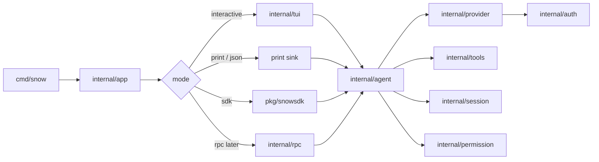
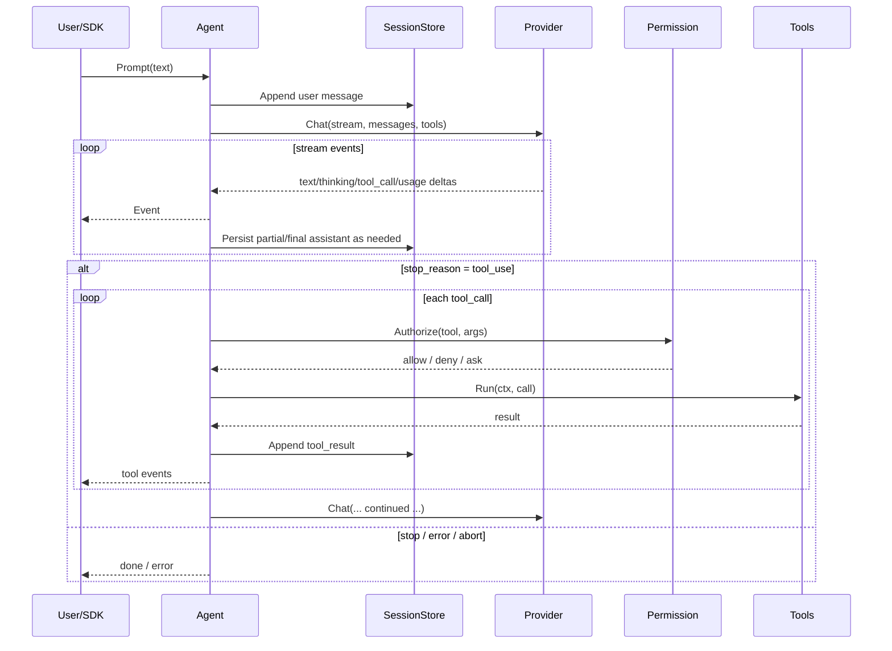

# snow-core — Implementation Research & Technical Design

> **Status:** Active pre-alpha implementation. The design remains the architecture/roadmap reference; verify current behavior in source and tests.
> **Binary:** `snow`  
> **Module:** `github.com/snow-core/snow`
> **Language:** Go
> **Surfaces:** Interactive TUI · print/JSON stream · embeddable SDK · JSONL RPC
> **Auth MVP:** OpenCode Go (API key) · ChatGPT/Codex browser/device OAuth, guarded refresh, and authenticated catalog runtime

This document is the architecture, design-history, and roadmap reference for **snow-core**: a standalone, modular, efficient coding-agent harness inspired by pi, OpenCode, and Codex—written in Go with a TUI and SDK. Current source and tests are the behavioral authority.

---

## Table of contents

1. [Overview](#1-overview)
2. [Architecture](#2-architecture)
3. [Public interfaces](#3-public-interfaces)
4. [Built-in tools](#4-built-in-tools)
5. [Auth and providers](#5-auth-and-providers)
6. [TUI](#6-tui)
7. [SDK](#7-sdk)
8. [Config and project context](#8-config-and-project-context)
9. [Security model](#9-security-model)
10. [Plugin and modularity model](#10-plugin-and-modularity-model)
11. [Repo bootstrap](#11-repo-bootstrap)
12. [Phased roadmap](#12-phased-roadmap)
13. [Testing and verification](#13-testing-and-verification)
14. [Research appendix](#14-research-appendix)
15. [Open risks and mitigations](#15-open-risks-and-mitigations)
16. [Glossary](#16-glossary)

---

## 1. Overview

### 1.1 Problem

Coding-agent harnesses today tend to fall into one of three traps:

| Trap | Examples of pressure | Cost |
|------|----------------------|------|
| **Heavy product surface** | Large Electron shells, many product modes | Slow iteration, hard to embed, high memory |
| **Hard to embed** | CLI-only with no stable library API | Every host reimplements the agent loop |
| **JS/TS-centric runtime** | Node agent cores | Higher baseline RAM/CPU; weaker single-binary story |

Builders who want a **small, fast, embeddable** harness with **subscription + API-key auth** often have to fork a large project or glue provider SDKs by hand.

### 1.2 Vision

**snow** is a minimal terminal coding harness and library:

- **Small Go core** — agent loop, sessions, tools, providers, permissions.
- **Streaming-first** — tokens and tool events flow to TUI/SDK without buffering full turns.
- **Pluggable edges** — providers and tools behind interfaces; optional JSON-RPC subprocess plugins.
- **Charm-style TUI** — interactive default UX.
- **Pure-Go SDK** — same core as the CLI; no duplicated loop.
- **Auth that matches real usage** — OpenCode Go API key and ChatGPT Plus/Pro (Codex) OAuth in MVP.

Philosophy (pi-aligned, Go-native):

> Ship powerful defaults. Keep the core small. Extend at the edges. Keep optional subagent orchestration root-scoped and built from the ordinary agent loop rather than a second runtime.

### 1.3 Competitive map

| System | Take | Reject / defer |
|--------|------|----------------|
| **pi** | Minimal core; JSONL tree sessions; SDK = same loop as CLI; project trust ≠ sandbox; four core tools; slash commands; event subscribe model | TypeScript extension VM; huge provider catalog day one; package ecosystem |
| **OpenCode** | Event-rich runtime ideas; permission ask/allow/deny; provider/model listing patterns; OpenCode Go as a first-class paid route | Becoming an OpenCode client; Electron; full plugin marketplace |
| **Codex / ChatGPT sub** | OAuth subscription path for Plus/Pro; “Codex for OSS” posture; browser login + headless paste fallback | Depending on closed CLI internals; coupling UI to OpenAI’s product chrome |
| **snow-agent (sibling)** | Brand/UX taste for power users (optional later) | Any Electron/IPC contract in v1; snow-core is **standalone**, not snow-agent backend yet |

### 1.4 Goals

- Single static-ish Go binary (`snow`) for macOS/Linux (Windows best-effort later).
- Modular packages with **no UI imports** inside `agent` / `provider` / `session`.
- MVP auth: **OpenCode Go** + **ChatGPT Codex OAuth**.
- Default built-in tools: **read, write, edit, bash, grep, glob**, direct **ask_user**, plus deferred **webfetch**.
- Surfaces: **TUI**, **print/JSON**, **SDK**; RPC mode documented for phase 3.
- Pure-Go **SQLite** sessions with provider-free first-prompt titles, manual rename, and indexed tree branches (`id` / `parentId`).
- Clear permission + project-trust model; honest non-sandbox security story.

### 1.5 Non-goals (v1)

- snow-agent / Electron integration.
- Full pi/OpenCode provider catalog.
- Built-in OS sandbox or container runtime (document optional backends only).
- An autonomous multi-agent workflow product. Snow provides only the bounded,
  opt-in root-scoped subagent tree documented below and in `docs/subagents.md`.
- Skills marketplace, theme marketplace, WASM extension runtime.
- Local vector memory DB, notes/tasks product surfaces.
- Guaranteeing ToS-proof reverse-engineering of undocumented endpoints (isolate adapters; prefer official Codex-for-OSS guidance).

### 1.6 Success criteria (product)

| Metric | Target |
|--------|--------|
| TUI cold start to editable prompt | **&lt; 100ms** on warm machine (no network) |
| Binary | One primary CLI; SDK is a library import |
| Auth | Both MVP providers complete a real multi-turn tool loop |
| Tools | read / write / edit / bash with path + permission gates |
| Embed | `pkg/snowsdk` can run headless prompt + event subscribe without TUI |
| Core size | Agent loop understandable in one package; extensions optional |

---

## 2. Architecture

### 2.1 Package map

```
github.com/snow-core/snow
├── cmd/snow                 # CLI entry (cobra)
├── internal/
│   ├── app                  # wire-up: config, auth, session, agent, mode select
│   ├── agent                # turn loop, tool dispatch, abort, retries
│   ├── provider             # Provider/Model/Stream + adapters
│   │   ├── opencodego       # OpenCode Go adapter
│   │   ├── openaicompat     # user-configured Responses/Chat Completions adapter
│   │   ├── responsesapi     # shared bounded Responses wire codec
│   │   └── chatgpt          # ChatGPT / Codex OAuth adapter
│   ├── auth                 # credential store, OAuth browser/device flows
│   ├── tools                # Tool interface, builtins, RPC host
│   │   └── builtin          # read, write, edit, bash, grep, glob, deferred webfetch
│   ├── session              # SQLite tree store, fork/resume/list
│   ├── context              # AGENTS.md discovery, system prompt assembly
│   ├── compact              # context compaction
│   ├── permission           # ask / allow / deny
│   ├── config               # global + project settings
│   ├── event                # typed events for TUI/SDK/RPC
│   ├── tui                  # bubbletea app
│   └── rpc                  # JSONL stdin/stdout mode (phase 3+)
└── pkg/
    ├── snowsdk              # public embed API (stable surface)
    └── protocol             # shared message/event DTOs if needed outside internal
```

**Import rules**

| Package | May import | Must not import |
|---------|------------|-----------------|
| `agent` | provider, tools, session, permission, event, context, compact | `tui`, `cmd`, `rpc` UI |
| `provider/*` | auth, config, protocol | tools, tui, agent |
| `tools` | permission, config | provider, tui |
| `tui` | event, app facades, config | provider HTTP details |
| `snowsdk` | internal via thin facades **or** duplicated stable types in `pkg/protocol` | bubbletea |
| `cmd/snow` | everything for wire-up | — |

Prefer **`pkg/protocol` + `pkg/snowsdk`** as the only stable external API. Everything under `internal/` can move freely.

### 2.2 Runtime modes



### 2.3 Core turn loop



**Loop invariants**

1. Every accepted user prompt gets a session entry before the first provider call (crash-safe intent).
2. Assistant messages are finalized with `stop_reason` before tool execution batch commits (or use explicit `pending` only in-memory, never as durable terminal state).
3. Tool results always reference `tool_call_id`; opening a session atomically repairs an interrupted final tool batch with explicit retryable/unknown-outcome results and never retries side effects automatically.
4. `context.Context` cancellation aborts provider stream **and** in-flight tools.
5. Events are the only cross-surface observation channel (TUI/SDK/print/RPC all subscribe).
6. Identical consecutive tool calls are detected per admitted run using canonical JSON arguments; bounded advisory reminders at counts 3, 5, and 8 do not veto execution.

### 2.4 Efficiency principles

| Principle | Practice |
|-----------|----------|
| Single binary | Avoid CGo; keep deps lean; Charm + stdlib HTTP |
| Stream, don’t buffer | Provider adapters yield deltas; TUI paints incrementally |
| Durable sessions | Pure-Go SQLite; WAL transactions; indexed branch queries; no full scan on open |
| Bound tool output | Truncate source output with clear markers; spill oversized final plain-text results to private session artifacts and prune historical results in every provider/summarizer projection |
| Cancel everywhere | `ctx` on HTTP, bash, file IO timeouts |
| Segregate packages | UI never blocks provider decode on render lock longer than one frame |
| Cheap default tools | Use bounded pure-Go `grep`/`glob` before shelling out |
| Plugins are cold | Subprocess plugins opt-in; document startup cost |
| Usage from provider | MVP trusts provider token usage; no local tokenizer required |

### 2.5 Dependency direction (summary)

```
cmd → app → {tui | print | rpc}
app → agent → {provider, tools, session, permission, context, compact, event}
provider → auth
snowsdk → app/agent facades + protocol
```

---

## 3. Public interfaces

Signatures below are **decision-complete sketches** (names may shift slightly at implement time; responsibilities must not).

### 3.1 Messages and content blocks

```go
// pkg/protocol/message.go (conceptual)

type Role string

const (
    RoleUser      Role = "user"
    RoleAssistant Role = "assistant"
    RoleTool      Role = "tool_result"
    RoleSystem    Role = "system"  // rare; prefer context assembly
    RoleCustom    Role = "custom"  // extensions / harness notes
)

type ContentBlock struct {
    Type string `json:"type"` // text | image | thinking | tool_call

    // text / thinking
    Text string `json:"text,omitempty"`

    // image
    MIMEType string `json:"mime_type,omitempty"`
    Data     []byte `json:"data,omitempty"` // base64 in JSONL on disk

    // tool_call
    ToolCallID string          `json:"tool_call_id,omitempty"`
    Name       string          `json:"name,omitempty"`
    Arguments  json.RawMessage `json:"arguments,omitempty"`
}

type Message struct {
    ID        string         `json:"id"`
    ParentID  string         `json:"parent_id,omitempty"`
    Role      Role           `json:"role"`
    Content   []ContentBlock `json:"content"`
    Timestamp int64          `json:"ts"` // unix ms

    // assistant metadata
    Provider   string      `json:"provider,omitempty"`
    Model      string      `json:"model,omitempty"`
    StopReason string      `json:"stop_reason,omitempty"` // stop|length|tool_use|error|aborted
    Error      string      `json:"error,omitempty"`
    Usage      *Usage      `json:"usage,omitempty"`

    // tool_result metadata
    ToolCallID string `json:"tool_call_id,omitempty"`
    ToolName   string `json:"tool_name,omitempty"`
    IsError    bool   `json:"is_error,omitempty"`
}

type Usage struct {
    Input      int `json:"input"`
    Output     int `json:"output"`
    CacheRead  int `json:"cache_read"`
    CacheWrite int `json:"cache_write"`
    Total      int `json:"total_tokens"`
    Cost       *Cost `json:"cost,omitempty"`
}

type Cost struct {
    Input      float64 `json:"input"`
    Output     float64 `json:"output"`
    CacheRead  float64 `json:"cache_read"`
    CacheWrite float64 `json:"cache_write"`
    Total      float64 `json:"total"`
}
```

### 3.2 Provider stream

```go
type Model struct {
    Provider         string
    ID               string
    DisplayName      string
    ContextWindow    int
    MaxOutputTokens  int
    SupportsTools    bool
    SupportsThinking bool
    ThinkingLevels   []ThinkingLevel // normalized non-off levels; off is implicit
    SupportsVision   bool
}

type ChatRequest struct {
    Model        Model
    Messages     []Message
    Tools        []ToolSchema
    System       string
    MaxTokens    int
    Temperature  *float64
    Thinking     ThinkingLevel // off|minimal|low|medium|high|xhigh|max|ultra
    // Model.ThinkingLevels is authoritative; unsupported non-off effort is rejected.
    // provider-specific extras isolated in adapter options
}

type StreamEventType string

const (
    EvStreamTextDelta     StreamEventType = "text_delta"
    EvStreamThinkingDelta StreamEventType = "thinking_delta"
    EvStreamToolCallDelta StreamEventType = "tool_call_delta"
    EvStreamToolCallDone  StreamEventType = "tool_call_done"
    EvStreamUsage         StreamEventType = "usage"
    EvStreamDone          StreamEventType = "done"
    EvStreamError         StreamEventType = "error"
)

type StreamEvent struct {
    Type       StreamEventType
    Text       string
    ToolCallID string
    ToolName   string
    Arguments  json.RawMessage // cumulative or final per adapter contract
    Usage      *Usage
    StopReason string
    Err        error
}

type EventStream interface {
    // Next blocks until the next event or EOF/error.
    Next(ctx context.Context) (StreamEvent, error)
    Close() error
}

type Provider interface {
    ID() string
    ListModels(ctx context.Context) ([]Model, error)
    // Resolve ensures credentials are valid (refresh OAuth if needed).
    Resolve(ctx context.Context, creds auth.Credential) error
    Chat(ctx context.Context, creds auth.Credential, req ChatRequest) (EventStream, error)
}
```

**Adapter contract:** each provider normalizes vendor SSE/JSON into `StreamEvent`. Tool-call argument streaming may be vendor-specific; adapters must emit a final `tool_call_done` with complete JSON arguments before the agent dispatches tools.

### 3.3 Tools

```go
type ToolSchema struct {
    Name        string          `json:"name"`
    Description string          `json:"description"`
    Parameters  json.RawMessage `json:"parameters"` // JSON Schema object
}

type ToolResult struct {
    Content []ContentBlock
    IsError bool
    // Details is tool-private metadata for TUI (e.g. diff stats); not sent to the model unless mirrored into Content.
    Details any
}

type ToolHost interface {
    CWD() string
    // Roots returns path roots the tool may touch (cwd + explicit allows).
    Roots() []string
    Permission() permission.Service
    EmitProgress(event ToolProgressEvent)
    Environ() []string
}

type Tool interface {
    Schema() ToolSchema
    Run(ctx context.Context, args json.RawMessage, host ToolHost) (ToolResult, error)
}

type Registry interface {
    Register(Tool) error
    Get(name string) (Tool, bool)
    Schemas() []ToolSchema
    List() []Tool
}
```

### 3.4 Session store

```go
type SessionHeader struct {
    Version   int    `json:"v"` // current: 2
    ID        string `json:"id"`
    CreatedAt int64  `json:"created_at"`
    CWD       string `json:"cwd"`
    Name      string `json:"name,omitempty"`
}

// SQLite stores the header in session_meta and entries in indexed rows.
type Entry struct {
    Type     string  `json:"type"` // message | compaction | meta
    ID       string  `json:"id"`
    ParentID string  `json:"parent_id,omitempty"`
    Message  *Message `json:"message,omitempty"`
    // compaction fields...
}

type SessionStore interface {
    ID() string
    Path() string // empty if in-memory
    Header() SessionHeader

    Append(entry Entry) error
    // BranchTip returns the active leaf id.
    BranchTip() string
    // SetBranchTip moves the active cursor (tree navigation).
    SetBranchTip(id string) error
    // Messages returns linearized messages from root → tip.
    Messages() ([]Message, error)
    Fork(fromID string) (SessionStore, error)
    Close() error
}

type SessionIndex interface {
    List(cwd string) ([]SessionInfo, error)
    Open(path string) (SessionStore, error)
    Create(cwd string) (SessionStore, error)
}
```

**On-disk layout**

```
~/.snow/sessions/<cwd-encoded>/<timestamp>_<suffix>.db
```

Current directories use `cwd-v2-<sha256(normalized-absolute-cwd)>`; the legacy
flattened encoder remains discoverable with stored-CWD verification. The SQLite
schema is **snow-owned**; old JSONL sessions are intentionally not migrated.

Prior-session reuse is deliberately narrower than a general memory product.
`session_search` rebuilds a disposable SQLite FTS5 corpus from same-project root
session names, direct user/final assistant text, and compaction summaries.
`session_reference` imports at most three tip-pinned, bounded, untrusted
snapshots per target branch. Tool content, reasoning, images, provider-private
data, credentials, permission/trust state, goals, queues, and child databases
are excluded; references transfer information only and no authority.

### 3.5 Agent

```go
type Agent interface {
    Prompt(ctx context.Context, text string, opts ...PromptOption) error
    Steer(text string) error     // active-run queue; next safe assistant+tool boundary
    FollowUp(text string) error  // active-run queue; after natural stop and all steering
    PendingInputs() protocol.InputQueue
    Abort(ctx context.Context) error
    Subscribe(func(AgentEvent)) (unsubscribe func)

    SetModel(model Model) error
    SetThinking(level ThinkingLevel)
    Model() Model
    Messages() []Message
    IsRunning() bool
}

type AgentEvent struct {
    Type string // session_updated | text_delta | thinking_delta | tool_start |
                // tool_progress | tool_end | permission_request |
                // user_input_request | usage |
                // turn_done | error | aborted
    // payload fields omitted — see pkg/protocol/events.go
}
```

### 3.6 Permission

```go
type Mode string // ask | allow | deny

type Request struct {
    Tool   string
    Args   json.RawMessage
    Paths  []string // affected paths if known
    Risk   string   // read|write|exec|network
    Reason string
}

type Decision string // allow | deny | allow_session | allow_always

type Service interface {
    Mode() Mode
    SetMode(Mode)
    // Authorize blocks when mode=ask and no cached rule matches.
    Authorize(ctx context.Context, req Request) (Decision, error)
    Remember(req Request, d Decision) // session or persistent scope
}
```

Interactive TUI supplies an `Asker`; headless SDK defaults to `deny` for mutating tools unless `Options.PermissionMode` or auto-approve is set.

### 3.7 Auth store

```go
type CredentialType string // api_key | oauth

type Credential struct {
    Provider string          `json:"-"`
    Type     CredentialType  `json:"type"`
    Key      string          `json:"key,omitempty"`
    Access   string          `json:"access,omitempty"`
    Refresh   string          `json:"refresh,omitempty"`
    Expires   int64           `json:"expires,omitempty"` // unix seconds
    AccountID string          `json:"accountId,omitempty"` // pi/Codex OAuth compatibility
    Extra     map[string]any  `json:"extra,omitempty"`
}

type Store interface {
    Get(provider string) (Credential, bool)
    Put(provider string, cred Credential) error
    Delete(provider string) error
    // Path for diagnostics (never print secrets).
    Path() string
}
```

---

## 4. Built-in tools

### 4.1 MVP set

| Tool | Purpose | Permission risk | Notes |
|------|---------|-----------------|-------|
| `read` | Read file contents (optional offset/limit) | read | Pinned `os.Root`; binary → short error; streams bounded windows |
| `write` | Create/overwrite file | write | Rooted parent creation; atomic same-directory replace; preserves existing mode |
| `edit` | Exact string replace / patch | write | Rooted atomic replacement; fails if `old_str` is not unique unless `replace_all` |
| `bash` | Run shell command in cwd | exec | Timeout; combined output bound; no implicit network policy |
| `grep` | Search text files with RE2 and line numbers | read | Pure Go; glob filter, case option, match/output caps |
| `glob` | Match regular file paths | read | Pure Go; `**` recursive segments and result/output caps |
| `ask_user` | Request one to three user decisions or free-form answers | read/interaction | Direct schema; TUI prompt, SDK callback, or RPC reply/reject; automatic Other choice |
| `update_plan` | Emit a turn-local implementation checklist | read | Direct Default-mode schema; structured cloned event; unavailable/rejected in Plan Mode; not persisted |
| `webfetch` | Fetch a public HTTP(S) resource | network | Deferred schema; Surf Chrome 150; secure TLS; HTML → Markdown; SSRF, timeout, redirect, media-type, and output bounds |

`grep`, `glob`, `ask_user`, `update_plan`, and `webfetch` are registered in the default builtin registry.
The file search tools skip
hidden/generated directories and symlink entries, and all search roots still
pass through the path guard. These reduce bash round-trips and improve Windows
behavior. `webfetch` is the first built-in deferred tool, so the normal app also
loads the small direct `search_tools` recovery schema while keeping the full
`webfetch` schema out of unrelated provider requests.

### 4.3 Schemas (conceptual)

**read**

```json
{
  "name": "read",
  "description": "Read a UTF-8 text file within allowed roots.",
  "parameters": {
    "type": "object",
    "required": ["path"],
    "properties": {
      "path": { "type": "string" },
      "offset": { "type": "integer", "description": "1-based start line" },
      "limit": { "type": "integer", "description": "max lines" }
    }
  }
}
```

**write**

```json
{
  "name": "write",
  "parameters": {
    "type": "object",
    "required": ["path", "content"],
    "properties": {
      "path": { "type": "string" },
      "content": { "type": "string" }
    }
  }
}
```

**edit**

```json
{
  "name": "edit",
  "parameters": {
    "type": "object",
    "required": ["path", "old_str", "new_str"],
    "properties": {
      "path": { "type": "string" },
      "old_str": { "type": "string" },
      "new_str": { "type": "string" },
      "replace_all": { "type": "boolean", "default": false }
    }
  }
}
```

**bash**

```json
{
  "name": "bash",
  "parameters": {
    "type": "object",
    "required": ["command"],
    "properties": {
      "command": { "type": "string" },
      "timeout_ms": { "type": "integer", "default": 120000 }
    }
  }
}
```

**webfetch**

```json
{
  "name": "webfetch",
  "discovery": {"mode": "deferred", "namespace": "web"},
  "parameters": {
    "type": "object",
    "required": ["url"],
    "properties": {
      "url": {"type": "string"},
      "timeout_ms": {"type": "integer", "minimum": 1, "maximum": 30000}
    }
  }
}
```

**ask_user**

```json
{
  "name": "ask_user",
  "parameters": {
    "type": "object",
    "required": ["questions"],
    "properties": {
      "questions": {
        "type": "array",
        "minItems": 1,
        "maxItems": 3,
        "items": {
          "required": ["id", "header", "question"],
          "properties": {
            "id": {"type": "string"},
            "header": {"type": "string"},
            "question": {"type": "string"},
            "options": {"type": "array", "minItems": 2, "maxItems": 3}
          }
        }
      }
    }
  }
}
```

`ask_user` has no discovery metadata: its full schema is sent with the other
direct built-ins on every tool-capable request. The explicit SDK/CLI `Tools`
allowlist remains authoritative. A choice returns its exact label; Other and
free-form responses return trimmed text. The model-facing result is ordered
JSON: `{"answers":[{"id":"...","answer":"..."}]}`.

### 4.4 Safety behaviors (all tools)

1. **Path confinement:** resolve symlinks; require final path under `Roots()` (cwd + configured allows).
2. **Deny escape:** `..` and symlink escapes return `IsError` without throwing panics.
3. **Output caps:** default 256 KiB per tool result; read/search stream bounded data and return explicit truncation markers.
4. **Atomic writes:** write stages content beside the destination, syncs it, and renames it into place; existing file permissions are retained.
5. **Secrets:** redaction hooks optional later; never echo auth file contents.
6. **bash:** `Setpgid` / process-group kill on Unix; Windows starts the shell suspended, assigns it to a kill-on-close Job Object, resumes its primary thread, and covers descendant cleanup with native tests.
7. **write/edit:** optional backup sibling `.snow-bak` **off** by default (explicit config).
8. **webfetch:** allow only public HTTP(S), disable environment proxies, validate every
   redirect, resolve and pin public addresses at dial time, verify TLS certificates,
   reject binary bodies, and label returned content as untrusted external data.

### 4.5 Tool dispatch policy

- Parallel tool calls: **serial in MVP** (simpler permissions + FS races); parallel opt-in later for read-only tools.
- `read`, `grep`, `glob`, and `ask_user` are `RiskRead`; `webfetch` is `RiskNet` and remains
  deferred/hidden in deny mode; write/edit/bash require permission according to mode.
- Unknown tool name → `tool_result` error string, not hard crash.
- Panic in tool → recovered to error result.
- Exact consecutive repeats are advisory-loop-guarded at escalating thresholds;
  bookkeeping tools may be transparent, and no reminder changes permission or
  execution policy.

---

## 5. Auth and providers

### 5.1 Credential file

**Path:** `~/.snow/auth.json`  
**Permissions:** `0600` (create/truncate with user-only mode)

```json
{
  "opencode-go": {
    "type": "api_key",
    "key": "oc-..."
  },
  "chatgpt": {
    "type": "oauth",
    "access": "...",
    "refresh": "...",
    "expires": 1730000000,
    "extra": {
      "account_id": "optional"
    }
  }
}
```

### 5.2 Resolution order

For a provider P:

1. Explicit CLI flag / SDK option (`--api-key`, `Options.Credential`)
2. `auth.json` entry for P
3. Environment variable for P
4. Else: interactive `/login` (TUI) or error (headless)

| Provider | Env var | auth.json key |
|----------|---------|---------------|
| OpenCode Go | `OPENCODE_API_KEY` | `opencode-go` |
| OpenAI-compatible | `OPENAI_API_KEY` (optional) | `openai-compatible` |
| ChatGPT Codex | *(none for OAuth)* | `chatgpt` |

> Note: pi stores OpenCode Go under `opencode-go` and also accepts `OPENCODE_API_KEY` shared with OpenCode Zen. snow MVP **only** wires OpenCode Go; do not silently alias Zen models unless added later.

### 5.3 OpenCode Go (API key)

**Role:** primary API-key provider for MVP.

| Item | Decision |
|------|----------|
| Provider ID | `opencode-go` |
| Auth | Bearer API key |
| Wire protocol | Verified OpenAI-compatible Chat Completions with SSE |
| Base URL | `https://opencode.ai/zen/go/v1`; overridable with `base_url` |
| Default model | `kimi-k2.6`, pinned while the live catalog is refreshed |
| Streaming | SSE `text/event-stream` |
| Tools | OpenAI-style `tools` / `tool_calls` normalized to snow events |

**Adapter responsibilities**

- Attach `Authorization: Bearer <key>`.
- Map stream chunks → `StreamEvent`.
- Map finish reasons → `stop|length|tool_use|error`.
- Surface rate-limit / quota errors as structured `EvStreamError`.
- Fetch live `GET /models` availability at startup and enrich matching IDs from
  OpenCode's public `https://models.dev/api.json` catalog; never send the API key
  to the metadata host, and let direct gateway fields win.
- Normalize display, context, output, pricing, tool/vision, and reasoning metadata.
- Fall back to the pinned static default without failing startup or logging keys.
- Map normalized effort to OpenAI `reasoning_effort`; reject levels not advertised by the selected model.

**Config knobs**

```json
{
  "providers": {
    "opencode-go": {
      "base_url": "https://opencode.ai/zen/go/v1",
      "default_model": "kimi-k2.6",
      "api_key_env": "OPENCODE_API_KEY"
    }
  }
}
```

### 5.4 ChatGPT Plus/Pro (Codex OAuth)

**Current implementation status:** `internal/provider/chatgpt` performs a
side-effect-free check of OAuth credentials, browser PKCE and device-code login,
compatible credential imports, guarded automatic refresh, an origin-and-account-scoped
ETag model cache, and hardened Codex Responses SSE streaming with branch-scoped
prompt affinity, zstd compression, bounded pre-output transient retries, structured
error diagnostics, and mandatory terminal events. The TUI/CLI report configured,
expired, or missing ChatGPT auth without refreshing during checks.
The implementation and endpoint notes below follow current official Codex behavior.

**Role:** subscription path for users with ChatGPT Plus/Pro via Codex-for-OSS compatible auth.

| Item | Decision |
|------|----------|
| Provider ID | `chatgpt` |
| Auth | OAuth2 authorization code + PKCE (browser) with **paste-redirect fallback** for SSH |
| Token storage | `auth.json` oauth fields; auto-refresh on 401/expiry |
| API | Codex / ChatGPT harness endpoints as documented for OSS clients — **adapter-isolated** |
| Models | Authenticated `/backend-api/codex/models` discovery with client-version query, versioned origin-and-account-scoped ETag/TTL cache, and bundled offline fallback |

**Login UX (`/login chatgpt`)**

1. Generate PKCE verifier/challenge + state.
2. Open the system browser to the authorization URL, or print it with `--no-open`.
3. The loopback server on `localhost:1455/auth/callback` receives the code; the CLI can instead accept the complete callback URL when the port is occupied or the browser is remote.
4. Exchange the code for access/refresh tokens and atomically write `auth.json` with mode `0600`.
5. Validate JWT/account metadata without persisting the ID token.
6. Force an authenticated model-catalog refresh while retaining the bundled fallback on outage.

**Logout:** delete the `chatgpt` credential and reset the in-memory catalog to the bundled fallback.

**Refresh and inference resilience:** before `Chat`, refresh credentials expiring within five minutes under the cross-process auth-store lock. A pre-stream 401 permits one guarded forced refresh and one retry; permanent refresh rejection requests re-login, while transient failures preserve the credential. Inference uses a non-secret SHA-256 session/branch/purpose affinity key in the Codex body and headers, zstd-compresses bodies at 32 KiB, and retries network, 408, 500, 502, 503, 504, or immediate pre-output overload/truncation failures twice with capped `Retry-After`-aware backoff. It never retries after normalized stream activity or for usage/client errors. WebSocket continuation remains deferred.

#### Compliance and risk (explicit)

- Follow **OpenAI Codex for OSS** guidance; this harness is a third-party client.
- Do not scrape undocumented web chat APIs if an official OSS path exists.
- Subscription benefits, rate limits, and ToS can change; isolate all HTTP paths in `internal/provider/chatgpt`.
- Document in README: user is responsible for account eligibility (Plus/Pro) and acceptable use.
- Never log access/refresh tokens.

### 5.5 OpenAI-compatible Responses and Chat Completions

`internal/provider/openaicompat` is the single user-configured compatible
provider (`openai-compatible`). It requires an absolute HTTP(S) API root or full
`/responses`/`/chat/completions` URL, derives sibling `GET /models`, and uses
optional Bearer auth from explicit options, `auth.json`, or `OPENAI_API_KEY`.
ID-only model records are tool-capable; optional image/reasoning/summary/verbosity
fields are emitted only from advertised metadata. Responses is preferred and
uses the bounded request/SSE codec shared with ChatGPT through
`internal/provider/responsesapi`. An HTTP 404/405/501 from Responses selects and
caches a Chat Completions/SSE fallback backed by the bounded OpenCode-compatible
codec; OAuth, Codex headers, refresh, and catalog behavior remain isolated.

There is no default endpoint. Discovery chooses the first valid model only when
no explicit/default model exists; otherwise unavailable discovery is nonfatal.
V1 excludes multiple named compatible endpoints and custom/Azure headers and
query parameters. The TUI `/login openai-compatible`
flow transactionally captures the endpoint and optional masked key, rebuilds the
runtime adapter, and refreshes discovery. Configured endpoints are
operator-trusted; userinfo/query/fragment URLs and cross-origin redirects are
rejected, and provider errors redact active keys.

### 5.6 Provider registry

```go
registry.Register(opencodego.New(cfg))
registry.Register(openaicompat.New(cfg))
registry.Register(chatgpt.New(cfg, oauthRunner))
```

CLI `--provider <id> --model <id>` and TUI `/model` both resolve through the same registry.

### 5.7 Implementation-time verify checklist (providers)

Must be completed in Phase 1–2 coding, results folded into adapter constants/tests:

- [x] OpenCode Go base URL(s) and auth header scheme — https://opencode.ai/zen/go/v1, `Authorization: Bearer <key>` (verified live: GET /models → 200; bad key on /chat/completions → 401 JSON)
- [x] OpenCode Go streaming endpoint path (chat completions vs responses) — OpenAI-compatible `POST /chat/completions` (SDK `@ai-sdk/openai-compatible`; no `responses` API)
- [x] OpenCode Go tool-call streaming shape — OpenAI `delta.tool_calls` with index/id/function fragments
- [x] OpenCode Go default + available model IDs — live catalog has 25 models incl. kimi-k2.6 (default), kimi-k3, deepseek-v4-pro/flash, qwen3.7-max/plus, glm-5.2, minimax-m3, gpt-5.6-luna, grok-4.5
- [x] ChatGPT/Codex OAuth authorize/token URLs and client id requirements researched against pi and official Codex
- [x] ChatGPT/Codex required headers researched (`Authorization`, `chatgpt-account-id`, `originator`)
- [x] ChatGPT/Codex models loaded from the authenticated backend catalog with a small bundled offline compatibility fallback
- [x] Error body shapes for quota/auth failures — normalized without exposing credentials
- [x] Cache token fields mapped from Codex Responses usage when present

---

## 6. TUI

### 6.1 Stack

| Library | Use |
|---------|-----|
| [`charmbracelet/bubbletea`](https://github.com/charmbracelet/bubbletea) | Elm-architecture TUI runtime |
| [`charmbracelet/lipgloss`](https://github.com/charmbracelet/lipgloss) | Style / layout |
| [`charmbracelet/bubbles`](https://github.com/charmbracelet/bubbles) | Textarea, viewport, spinner, list |
| [`charmbracelet/glamour`](https://github.com/charmbracelet/glamour) | Markdown render (assistant messages) |
| [`charmbracelet/huh`](https://github.com/charmbracelet/huh) optional | Forms for login/permissions |

### 6.2 Layout

```
┌──────────────────────────────────────────────────────────┐
│ header (optional): version, shortcuts hint               │
├──────────────────────────────────────────────────────────┤
│                                                          │
│  finalized transcript (native terminal scrollback)       │
│   - user bubbles                                         │
│   - assistant markdown + persistent streamed thinking    │
│   - tool cards (name, status, truncated output)          │
│   - errors / notifications                               │
│                                                          │
├──────────────────────────────────────────────────────────┤
│  permission modal / model picker (overlays when active)  │
├──────────────────────────────────────────────────────────┤
│  editor (textarea)                                       │
│  multi-line; paste; @ file path completion (phase 2)     │
├──────────────────────────────────────────────────────────┤
│  footer: cwd · session · provider/model · tokens · state │
└──────────────────────────────────────────────────────────┘
```

### 6.3 Slash commands (MVP → phase 2)

| Command | Phase | Behavior |
|---------|-------|----------|
| `/login` | 1–2 | Provider picker; API key prompt or OAuth |
| `/logout` | 2 | Clear provider creds |
| `/model` | 1 | Interactive model picker; selection persists to `~/.snow/config.json` |
| `/settings` | 2 | Persistent model, thinking, ChatGPT reasoning-summary/text-verbosity, and permission panel |
| `/new` | 1 | New session |
| `/resume [path]` | 2 | Pick a current-directory session, or resume an explicit SQLite path |
| `/permissions` | 2 | ask/allow/deny; interactive Allow/Allow-always/Deny picker on requests (no typing) |
| `/compact` | 2 | Manual compaction; all turn types also compact automatically at a configurable pressure threshold with one overflow-repair retry |
| `/sessions` | 2 | Open a compact picker for persisted sessions in the current directory |
| `/tree` | 4 | Select or fork a durable branch in the active session |
| `/quit` | 1 | Exit |

### 6.4 Keybindings (defaults)

| Key | Action |
|-----|--------|
| `enter` | Send while idle; queue one steering message while busy |
| `alt+enter` | Newline while idle; queue one follow-up while busy |
| `ctrl+j` | Reliable newline while idle or busy |
| `ctrl+c` / `esc` | Abort running turn, clear queues, and restore queued TUI text |
| `ctrl+d` | Quit on empty editor |
| `ctrl+l` | `/model` |
| wheel/trackpad (`tui.mouse: true`) | Scroll transcript viewport |
| primary-button drag (`tui.mouse: true`) | Select, highlight, and copy transcript text |
| `F6` | Toggle app mouse handling/native terminal selection |
| `pgup/pgdn` | Scroll transcript viewport |

Implemented: versioned YAML overrides load from `$SNOW_HOME/keybindings.yaml`
and trusted project `.snow/keybindings.yaml`; custom semantic adaptive themes
load from bounded `themes/*.yaml` directories with project-over-global
precedence, strict validation, diagnostics, and safe emergency bindings.

### 6.5 Event → UI mapping

| AgentEvent | UI |
|------------|----|
| `text_delta` | Append to live assistant buffer |
| `thinking_delta` | Append to persistent muted Markdown thinking region; show animated wait state before the first delta |
| `tool_start` | Open native tool card (correlation id remains protocol-only) |
| `tool_progress` | Append bounded progress line |
| `tool_end` | Finalize card with duration, status, and bounded output preview |
| `permission_request` | Modal; block tool until decision |
| `user_input_request` | Inline choice/free-form interaction; Esc rejects the tool and Ctrl+C aborts the turn |
| `usage` | Always-visible current/model context counter in the footer |
| `turn_done` | Unlock editor; finalize bubbles |
| `error` | Error banner |

**Performance:** Bubble Tea renders after every `Update`, so the TUI coalesces
queued stream events (bounded batch), caches stable transcript rendering, and
composes one alternate-screen frame from a sticky header, Bubbles viewport,
composer, and footer. `tui.mouse` defaults on so wheel input stays inside Snow; cell-motion mode also provides application-owned drag selection/copy. Runtime F6 toggles native selection mode, and Apple Terminal supports Fn-drag as its native-selection override while mouse mode remains enabled. It does not change renderer ownership. See `docs/tui-performance.md`.

### 6.6 Themes

Built-in adaptive, dark, light, and high-contrast palettes are joined by bounded
YAML semantic token maps under `~/.snow/themes/*.yaml` and trusted project
`.snow/themes/*.yaml`.

---

## 7. SDK

### 7.1 Goals

- Embed the **same** agent loop as the CLI.
- No bubbletea dependency in the hot path of library consumers.
- Stable event types versioned in `pkg/protocol`.

### 7.2 Surface

```go
package snowsdk

type Options struct {
    CWD             string
    Provider        string
    Model           string
    SessionPath     string // existing SQLite .db to resume; empty creates a new session
    NoSession       bool   // use an ephemeral in-memory session
    AuthPath        string // default ~/.snow/auth.json
    ConfigPath      string
    PermissionMode  string // ask|allow|deny; default deny for mutating in non-TTY
    AutoApprove     bool   // dangerous; for trusted CI only
    Tools           []string // subset allowlist; empty = defaults
    SystemPrompt    string
    Thinking        string
    UserInputHandler func(context.Context, protocol.UserInputRequest) (protocol.UserInputResponse, error)
    // Credential overrides...
}

type Session struct { /* opaque */ }

func Open(ctx context.Context, opts Options) (*Session, error)

func (s *Session) Prompt(ctx context.Context, text string) error
func (s *Session) PromptWithMode(ctx context.Context, text string, mode protocol.CollaborationMode) error
func (s *Session) Steer(ctx context.Context, text string) error
func (s *Session) FollowUp(ctx context.Context, text string) error
func (s *Session) PendingInputs() (protocol.InputQueue, error)
func (s *Session) Abort(ctx context.Context) error
func (s *Session) Subscribe(func(protocol.AgentEvent)) (cancel func)
func (s *Session) Model() protocol.Model
func (s *Session) SetModel(protocol.Model) error
func (s *Session) Mode() protocol.CollaborationMode
func (s *Session) SetMode(protocol.CollaborationMode) error
func (s *Session) Messages() ([]protocol.Message, error)
func (s *Session) Close() error
```

### 7.3 Example

```go
s, err := snowsdk.Open(ctx, snowsdk.Options{
    CWD:            ".",
    Provider:       "opencode-go",
    PermissionMode: "allow", // careful
})
if err != nil { log.Fatal(err) }
defer s.Close()

s.Subscribe(func(ev protocol.AgentEvent) {
    if ev.Type == "text_delta" {
        fmt.Print(ev.Text)
    }
})

if err := s.Prompt(ctx, "List Go files and summarize main packages."); err != nil {
    log.Fatal(err)
}
```

### 7.4 Print / JSON CLI mode

```bash
snow -p "fix the build" --provider opencode-go
snow --mode json -p "..."    # JSONL events to stdout
```

JSON event lines mirror `protocol.AgentEvent` for easy piping.

### 7.5 RPC mode

JSONL over stdin/stdout (pi-inspired):

- Commands: `prompt`, `abort`, `user_input_reply`, `user_input_reject`, `set_model`, `set_thinking`, `session_info`, …
- Events: same as SDK events  
- Framing: split on `\n` only (not Unicode line separators)

RPC prompts run asynchronously so the command reader remains available while
the agent waits. `user_input_reply.params` is a `UserInputResponse`;
`user_input_reject.params` contains `request_id`. EOF closes the interactive
input broker so pending/future questions fail fast while an ordinary one-shot
prompt is still allowed to finish.

Primary consumers: non-Go hosts, IDE bridges. Go hosts should prefer `snowsdk`.

---

## 8. Config and project context

### 8.1 Paths

| Path | Purpose |
|------|---------|
| `~/.snow/config.json` | Global settings |
| `~/.snow/system.md` | Suggested optional configured system preamble |
| `~/.snow/auth.json` | Secrets |
| `~/.snow/trust.json` | Project trust decisions |
| `~/.snow/sessions/` | Pure-Go SQLite session databases |
| `~/.snow/models-cache.json` | Reserved for future persistent catalog caching; current discovery is startup-only |
| `~/.snow/keybindings.yaml` | Versioned global TUI binding overrides |
| `~/.snow/themes/*.yaml` | Versioned custom semantic themes |
| `~/.snow/search.yaml` | Git-aware grep/glob search policy |
| `<project>/AGENTS.md` | Always-on project instructions (if present) |
| `<project>/.snow/config.json` | Project settings (trust-gated) |
| `<project>/.snow/plugins/*` | Phase 4 plugin manifests (trust-gated) |

### 8.2 Global config shape (MVP)

```json
{
  "default_provider": "opencode-go",
  "default_model": "",
  "permission_mode": "ask",
  "default_project_trust": "ask",
  "thinking": "off",
  "reasoning_summary": "auto",
  "text_verbosity": "low",
  "system_prompt_file": "system.md",
  "tool_output_bytes": 262144,
  "bash_timeout_ms": 120000,
  "providers": {
    "opencode-go": { "base_url": "", "default_model": "" },
    "chatgpt": { "default_model": "" }
  },
  "tui": {
    "theme": "default",
    "mouse": true
  }
}
```

### 8.3 Context assembly order

1. Base preamble: explicit SDK `SystemPrompt`, trusted-project configured file,
   global configured file, or embedded `internal/context/system.md`.
2. `AGENTS.md` walk: cwd → parents (cap depth / total bytes).
3. Optional `CLAUDE.md` compatibility read (**off** in current app wiring).
4. Startup skill metadata, MCP instructions, and subagent guidance when enabled.
5. Per-request collaboration-mode instructions from embedded
   `internal/plan/system.md` and activated-skill instructions.
6. Goal-bearing turns receive separate trailing internal context rendered from
   embedded templates under `internal/goal/`; this is not system context.

Configured prompt files are bounded by `context_cap_bytes`; project prompt paths
are trust-gated, confined to the canonical project root, and reject symlink
components. `AGENTS.md` content uses the same byte budget and adds a truncation
notice when needed.

### 8.4 Project trust

Mirrors pi’s *input-loading guard*, **not** a sandbox.

**When prompted:** every previously undecided project in the interactive TUI,
before runtime construction. This intentionally covers trust-sensitive resources
added after the first launch.

**Decisions:** store canonical exact path → `allow` | `deny` in
`~/.snow/trust.json`; nearest ancestor decisions apply until an exact child
override exists. Decisions load or block project config, configured
system-prompt files, plugins, MCP declarations, and skills on the same launch.

**Headless:** `default_project_trust: ask` behaves as **deny**. Global policy is
`ask|allow|deny`; legacy `always|never` remain aliases. Headless surfaces never
prompt. Runtime `/trust allow|deny` changes apply on the next launch.

**Always loaded without trust:** `AGENTS.md` (documented residual prompt-injection risk).

---

## 9. Security model

### 9.1 Boundary statement

snow runs **as the user**. Built-in tools can read/write files and execute commands with the process’s OS permissions. There is **no** in-process sandbox in v1.

### 9.2 Controls we do implement

| Control | Protects against |
|---------|------------------|
| Project trust | Silent malicious project config/plugins |
| Permission mode | Unreviewed write/exec tool calls |
| Path roots | Casual path escape from tools |
| auth.json 0600 | Casual local secret read by other users |
| No secret logging | Token leakage in debug output |
| Truncation | Context blow-ups from huge tool dumps |

### 9.3 Residual risks (accepted)

- Prompt injection via repo files, `AGENTS.md`, tool output.
- Malicious bash once allowed.
- OAuth tokens on disk stolen by malware running as user.
- Supply-chain risk in dependencies and external plugins.

### 9.4 Recommendations (docs/README)

- Use disposable credentials when possible.
- Run untrusted repos in a VM/container.
- Prefer `permission_mode: ask` interactively.
- Never set `AutoApprove` in SDK on untrusted input.

### 9.5 Future isolation backends (not MVP)

- Tool execution via Docker/bubblewrap supervisor.
- Network-less bash profile.
- Separate subprocess FS worker with seccomp (Linux).

---

## 10. Plugin and modularity model

### 10.1 Locked decision

| Layer | Mechanism |
|-------|-----------|
| Core builtins | Go `Tool` / `Provider` interfaces, in-process |
| Optional external capabilities | **JSON-RPC over stdio** subprocess plugins |
| Deferred tool discovery | In-memory Bleve BM25 over opt-in metadata; schemas stay in the registry |
| Explicitly avoided as primary | `plugin.Open` Go `.so` shared libraries (portability/pain) |
| Skills (phase 4) | Markdown playbooks, not executable code |

### 10.2 In-process registration

```go
func RegisterBuiltins(r tools.Registry) {
    r.Register(builtin.NewRead())
    r.Register(builtin.NewWrite())
    r.Register(builtin.NewEdit())
    r.Register(builtin.NewBash())
}
```

Build tags may exclude heavy adapters for minimal binaries later (`//go:build chatgpt`).

### 10.3 Extensibility core and subprocess protocol v2

The extensibility core is implemented in `pkg/plugin`, `internal/tools`, and
`internal/plugin`. Static Go plugins use `Manifest`, `Register`, and `Close`; no
Go shared-object loading is used. The manager owns registration, namespaced tool
descriptors, event subscriptions, diagnostics, and reverse-order lifecycle.

External runtimes use JSON-RPC 2.0 JSONL on stdin/stdout, with stderr reserved
for bounded diagnostics. Request IDs are strings and one reader multiplexer
supports concurrent calls:

```json
{"jsonrpc":"2.0","id":"1","method":"initialize","params":{"protocol_version":2,"cwd":"...","session_id":"..."}}
{"jsonrpc":"2.0","id":"1","result":{"manifest":{"id":"my-tools","name":"My tools","version":"0.1.0","protocol_version":2},"tools":[...]}}
```

The host sends `initialize`, `tools/list`, `tools/call`, and `shutdown`.
Progress, explicitly subscribed sanitized observation events, cancellation, and
bounded logs are notifications. Empty `supported_events` means no event fanout;
delivery is best effort and cannot block the agent loop. External tool risk is
optional (`read|write|exec|network`) and fails closed to `exec`; per-tool
capabilities and private raw-JSON result details survive registry adaptation.
Frames, input/output, progress, stderr, timeouts, cancellation, and concurrent
calls are bounded. Commands are argv arrays and never shell strings.

Project-local plugin declarations are trust-gated. Trust controls input
loading, not plugin permissions or OS access; untrusted plugins need a
container/VM/OS sandbox. Persistent JavaScript and Python examples implement
protocol v2 under `examples/plugins`, and `snow plugin check` performs a
provider-free live handshake with schema/event/risk and bounded-diagnostics
reporting. MCP and Agent Skills remain separate adapters/resources over the
registry. The canonical wire contract is `docs/plugin-protocol.md`; runtime
selection benchmarks and deferrals are in `docs/plugin-js-python-research.md`.

### 10.4 MCP and Agent Skills

`internal/mcp` uses the official `modelcontextprotocol/go-sdk` v1.7.0. It
negotiates the current stateless `2026-07-28` protocol and the SDK's supported
legacy revisions across stdio and Streamable HTTP. Server tools become
permissioned `mcp_<server>_<tool>` descriptors. Resources, templates,
subscriptions, and prompts use generic namespaced bridges; tool-list changes
atomically refresh the registry and BM25 index. Static HTTP headers and stdio
environment values support environment expansion without entering diagnostics.
Project server config is trust-gated. See `docs/mcp.md`.

The CLI separates side-effect-free configuration inspection (`mcp list|get`)
from live connection checks (`mcp check`) and atomically manages global or
project declarations through `add|enable|disable|remove`. Targeted JSON updates
preserve unrelated and unknown config fields; all inspection output redacts
credential-bearing values.

`internal/skills` implements the open Agent Skills `SKILL.md` format. Startup
discovery strictly validates standard metadata and loads only names/descriptions
from standard user and trust-gated project paths under a 64 KiB catalog budget.
`activate_skill` loads escaped full instructions, the TUI autocompletes enabled
leading `$skill-name` directives, and a directive activates before provider
dispatch while recording branch-scoped state,
and `read_skill_resource` verifies the discovery-time directory identity before
using a pinned per-operation `os.Root` for bounded streaming resource access.
Activated content is reattached on every provider call and reconstructed from
successful markers/session history after resume so compaction does not drop it;
current trust/disable/tool policy filters stale activations. See `docs/skills.md`.

Discovery retains a management inventory alongside the enabled catalog.
Global and trust-gated project `skills.disabled`/`skills.overrides` policy can
hide entries from prompts and activation without deleting their files. CLI
`skills list|get|enable|disable`, SDK `SkillInventory`, and read-only TUI
`/skills` expose that inventory; `/mcp` similarly exposes current server state.

### 10.5 Tool schema routing

Existing tools and zero-value discovery metadata remain always loaded. Native,
Go-plugin, external-plugin, SDK, and MCP registrations may opt into
`deferred` discovery per tool. Snow builds an in-memory Bleve BM25 index after
startup registration, indexes only name/namespace/description/keywords, and
loads the top five permitted full schemas from the authoritative registry.
`search_tools` provides an explicit recovery pass, while index/search failures
fall back to direct exposure for that turn. Routing emits structured metrics but
does not make an extra LLM call. See `docs/tool-routing.md`.

### 10.6 What is not a plugin

- Themes, keybindings, model lists → config.
- Skills/prompts → resource discovery and markdown activation.
- Compaction strategies → internal interfaces first.

---

## 11. Repo bootstrap

### 11.1 Target tree (when coding starts)

```
snow-core/
  IMPLEMENTATION.md          # this file
  README.md
  go.mod
  go.sum
  cmd/snow/main.go
  internal/app/
  internal/agent/
  internal/provider/
  internal/provider/opencodego/
  internal/provider/chatgpt/
  internal/auth/
  internal/tools/
  internal/tools/builtin/
  internal/session/
  internal/context/
  internal/compact/
  internal/permission/
  internal/config/
  internal/event/
  internal/tui/
  internal/rpc/              # phase 3
  pkg/snowsdk/
  pkg/protocol/
  testdata/
  scripts/
  .gitignore
```

### 11.2 Suggested dependencies

| Dep | Why |
|-----|-----|
| `github.com/spf13/cobra` | CLI |
| `github.com/charmbracelet/bubbletea` | TUI |
| `github.com/charmbracelet/lipgloss` | Style |
| `github.com/charmbracelet/bubbles` | Components |
| `github.com/charmbracelet/glamour` | Markdown |
| `github.com/enetx/surf` | Chrome-profile public web fetching |
| `github.com/JohannesKaufmann/html-to-markdown/v2` | Bounded HTML-to-Markdown conversion |
| `golang.org/x/oauth2` | OAuth helpers |
| `github.com/google/uuid` | IDs |
| `github.com/tidwall/gjson` / `sjson` optional | Fast JSON surgery for streams |

Avoid: heavy ORMs, full cloud SDKs when raw HTTP + SSE suffices.

### 11.3 Go version

- Minimum language/toolchain line: **Go 1.27**. `go.mod` currently uses
  **1.27rc2**, the available toolchain required by Surf v1.0.203.
- Hosted Linux/macOS CI runs `go test ./...`; Linux also runs the race detector.

### 11.4 Module path

Placeholder: `github.com/snow-core/snow`  
Replace with the real GitHub/Git path at first `go mod init` without redesign.

---

## 12. Phased roadmap

### Phase 0 — Spec and skeleton

**Deliverables**

- [x] `IMPLEMENTATION.md` (this document)
- [x] `go.mod`, `cmd/snow` stub printing version
- [x] `pkg/protocol` types
- [x] Interface files compiling with `fake` provider
- [x] In-memory session store + unit tests
- [x] README: vision, non-goals, how to run tests

**Exit criteria:** `go test ./...` green; no network.

---

### Phase 1 — Vertical slice

**Deliverables**

- [x] Agent loop with serial tool dispatch
- [x] SQLite session persistence (create/load indexed branch tip)
- [x] Tools: `read`, `bash` (write/edit can stub deny)
- [x] Provider: **OpenCode Go** streaming chat + tools
- [x] OpenCode Go startup model discovery with live availability, models.dev
  capability/reasoning enrichment, and a conservative static fallback
- [x] Normalized model-aware reasoning effort (`off|minimal|low|medium|high|xhigh|max|ultra`) across provider adapters
- [x] Auth: API key from env + `auth.json`
- [x] Print mode: `snow -p "..."` 
- [x] Basic TUI: transcript + editor + footer, always-visible context usage, and `/model` `/new` `/quit`
- [x] System prompt + `AGENTS.md` load
- [x] Context cancel / ctrl+c abort

**Acceptance tests**

- Fake provider scripted tool-call round-trip unit test.
- Manual: OpenCode Go key lists files via model+`bash`/`read` in a sample repo.
- Session file reloads and continues tip.

---

### Phase 2 — ChatGPT OAuth, mutations, permissions

**Deliverables**

- [x] Tools: `write`, `edit` with path gates
- [x] Permission service (`ask`/`allow`/`deny`; TUI `/permissions` command; headless default deny)
- [x] `/login` `/logout` for API keys; ChatGPT OAuth status is available through `/login` and `snow auth check chatgpt`
- [x] ChatGPT browser/device OAuth login, guarded token refresh, and authenticated cached model discovery
- [x] `/sessions`, `/resume`, and `/new` — titled current-directory listing, picker rename, resume, and new-session flow
- [x] Durable same-database branches, SDK branch APIs, and TUI `/tree` picker
- [x] Manual `/compact` — model-backed summary with deterministic fallback and a logical context boundary; full history remains append-only
- [x] Pre-runtime interactive project trust prompt + canonical `trust.json` parent-walk and `/trust` command
- [x] Permission `ask` mode — TUI interactive asker via `/allow` `/deny` (/allow always); headless defaults to deny

**Acceptance tests**

- OAuth login succeeds on Plus/Pro test account; second run uses refresh without browser.
- Write tool blocked in `deny`; prompted in `ask`; silent in `allow`.
- Compaction reduces message count; model still answers with summary context.

---

### Phase 3 — SDK polish, search tools, RPC

**Deliverables**

- [x] Public `pkg/snowsdk` stable enough for external sample
- [x] `grep` + `glob` builtins
- [x] `--mode json` event stream
- [x] RPC JSONL mode skeleton
- [x] Extensibility core — public Go plugin API, lifecycle manager, descriptor registry, observe-only events, and JSON-RPC v2 stdio host
- [x] Bounded root steer/follow-up queue across Agent, SDK, RPC, and TUI, with safe tool-batch boundaries and abort restoration

**Acceptance tests**

- [x] Standalone `examples/sdk` module builds and runs against `pkg/snowsdk`.
- [x] JSON mode parses with `jq`.
- [x] Dependency-free Python RPC client sends `prompt`, consumes events, and
  waits for `turn_done`.

---

### Phase 4 — Extensibility and UX depth

**Deliverables**

- [x] Agent Skills `SKILL.md` format — separate resource/progressive-disclosure layer
- [x] MCP client — official Go SDK, 2026-07-28/legacy negotiation, stdio/Streamable HTTP, tools/resources/prompts
- [x] Themes + keybindings files (bounded strict YAML, trusted project overrides)
- [x] Persistent ChatGPT model catalog refresh/cache (account- and backend-origin-scoped ETag/TTL entries)
- [x] Durable fork/tree navigation (`/tree` picker)
- [x] Optional sandbox backend design investigation — no built-in backend planned now; use whole-process container/VM isolation when required
- [x] Windows path/bash story hardened (suspended Job assignment, PowerShell, path aliases, atomic replacement, native script)
- [x] Plugin tool appears in schema and executes through the central permission gate
- [x] Opt-in BM25 tool routing keeps deferred parameter schemas out of normal model context
- [x] Namespace-first in-memory BM25 routing with deterministic global rescue and bounded summaries
- [ ] Optional semantic/vector routing remains deferred pending a locally downloadable open-source model with acceptable licensing, macOS/Linux/Windows support, binary size, memory use, and startup time; no mandatory API/service

**Acceptance tests**

- Custom theme/keybindings load with safe fallback; skill activates through `$name`/`activate_skill` and survives compaction.
- MCP stateless HTTP and stdio servers negotiate the expected protocol and execute through permissions.
- Plugin tool appears in schema and executes through the manager/registry path.

---

## 13. Testing and verification

### 13.1 Unit

| Area | Cases |
|------|-------|
| Session tree | append, branch tip, fork, reload SQLite |
| Path safety | symlink escape, outside root, unicode paths |
| Edit tool | unique/non-unique `old_str`, replace_all |
| Auth store | 0600 permissions, round-trip, delete |
| OAuth refresh | mock clock expiry |
| Event order | tool_start before tool_end; turn_done last |
| Permission | mode matrix + remember rules |
| Model/reasoning | provider catalog metadata, conservative effort filtering, wire mappings, and unsupported-level rejection |

### 13.2 Integration

- `fake` provider with deterministic script:
  1. assistant tool_call read
  2. consume tool_result
  3. final text
- Agent end-to-end tests (`internal/agent/agent_e2e_test.go`) run the real
  read/write/edit/bash/grep/glob registry through streamed multi-tool turns, exercise the
  deny/allow/ask permission matrix, verify ordered tool results, cover provider
  resolve/chat/stream/EOF failures, and reopen SQLite sessions for continuation.
- CLI end-to-end tests (`cmd/snow/main_test.go`) drive Cobra print and JSON modes
  against a local OpenAI-compatible SSE server; no credentials or network are
  required.
- Temp dir workspace fixtures under `testdata/workspaces/`.

### 13.3 Manual

- TUI smoke on Terminal.app / iTerm / Ghostty / VS Code terminal.
- Real OpenCode Go key multi-turn edit.
- Real ChatGPT OAuth on local + SSH paste path.
- Abort mid-stream and mid-bash.

### 13.4 Benchmarks (phase 1+)

| Bench | Goal |
|-------|------|
| `TestTUIStartup` | &lt; 100ms to first frame (fake deps) |
| Stream lag | UI shows first delta &lt; 50ms after recv |
| Large session reload | 10k entries load &lt; 500ms |

### 13.5 CI

`.github/workflows/ci.yml` runs on pushes, pull requests, and manual dispatches:

- Linux and macOS: formatting (Linux), vet, `go test ./...`, production build,
  and credential-free standalone SDK/RPC example execution.
- Linux: `go test -race ./internal/... ./pkg/snowsdk`.

The hosted workflow is network-free after dependency download and requires no
provider credentials. Real-provider checks remain manual; Windows verification
is available through `scripts/test-windows.ps1` but is not a hosted gate.

---

## 14. Research appendix

### 14.1 pi patterns worth copying

| Pattern | Why |
|---------|-----|
| Minimal core tools (read/write/edit/bash) plus bounded search | Forces good agent behavior; easy to reason about |
| SQLite session with tree `id`/`parentId` | Indexed branch/resume without a server |
| SDK session = CLI core | No dual maintenance |
| Project trust ≠ sandbox | Honest security story |
| Event subscribe model | TUI/RPC/SDK share one bus |
| auth.json 0600 + env fallback | Simple operator UX |
| OpenCode Go as `OPENCODE_API_KEY` / `opencode-go` | Known user demand |

References (local install / upstream docs):

- pi README — modes: interactive, print/JSON, RPC, SDK
- `docs/sessions.md` — SQLite schema, indexed branch queries, pragmas, and usage
- `docs/providers.md` — subscriptions vs API keys; OpenCode Go row
- `docs/sdk.md` — `createAgentSession`, subscribe, prompt
- `docs/security.md` — trust vs sandbox
- `docs/rpc.md` — JSONL framing pitfalls

### 14.2 OpenCode / snow-agent lessons

From the sibling **snow-agent** Electron app (OpenCode-hosted):

- Event coalescing matters for UI performance.
- Permission snapshots and ask/allow/deny are user-visible safety.
- Rich product features (memory DB, goal mode, research mode) explode scope — **keep out of snow-core v1**.
- snow-core should remain a **harness**, not a full IDE product.

### 14.3 Codex / ChatGPT subscription

- OpenAI publicly discusses **Codex for OSS** harness integration with ChatGPT subscription auth.
- pi implements ChatGPT Plus/Pro (Codex) via `/login` OAuth and stores tokens in auth.json.
- Implementation must track **current** official endpoints and client requirements; treat any community reverse-engineering as unstable.
- Mitigation: single adapter package + verify checklist + feature flag to disable chatgpt builds.

### 14.4 Go TUI ecosystem

Charmbracelet (Bubble Tea) is the de-facto standard for modern Go CLIs (gh-like UX). It fits streaming agent UIs via `Program.Send` from agent goroutines.

### 14.5 What “efficient” means here

| Axis | Choice |
|------|--------|
| Memory | Go single binary; stream processing; SQLite queries only materialize the active branch |
| CPU | Coalesced UI updates; serial tools MVP; compiled pure-Go search matchers |
| Disk | Append-only logs; bounded tool output |
| Network | HTTP/2 keep-alive client per provider; cancelable streams |
| Extensibility tax | Pay subprocess cost only when plugins enabled |

---

## 15. Open risks and mitigations

| Risk | Impact | Mitigation |
|------|--------|------------|
| OpenCode Go API shape differs from OpenAI-compatible assumptions | Phase 1 blocked | Probe first day; isolate adapter; golden stream fixtures |
| ChatGPT OAuth / Codex endpoint churn | Login breaks | Adapter isolation; version pin notes; paste fallback; CI smoke with secret |
| ToS / account policy changes | Legal/product | README compliance; official OSS paths only; easy provider disable |
| Terminal keybinding variance | Bad editor UX | Document per-terminal newlines; config overrides |
| Symlink path escapes | File safety bug | Thorough tests; `EvalSymlinks` + prefix check |
| Model ignores tool schema | Poor loops | Tight tool descriptions; retry once on malformed args |
| Scope creep from snow-agent features | Never ships | This doc’s non-goals; phase gates |
| Parallel tool FS races | Data loss | Serial tools until explicit read-only parallel |

---

## 19. Codex-style subagent tree (implemented)

Snow implements the Codex V2 architecture directly. `internal/subagent.Manager`
owns canonical path identity, parent edges, reservation/commit, validated state
transitions, execution slots, limits, mail routing, child construction,
persistence, and shutdown. Every child is an ordinary `internal/agent.Agent`;
`agent` does not import `subagent`, and collaboration enters through registered
tools plus its generic attributed mailbox.

The seven direct model tools are `spawn_agent`, `list_subagent_models`, `send_message`, `followup_task`,
`wait_agent`, `interrupt_agent`, and `list_agents`. Tool instances bind caller
identity. Spawn/follow-up use `permission.RiskDelegate`; remaining controls use
read risk. `wait_agent` supports the original next-activity barrier and an
`until=all` descendant join with aggregate running/queued/terminal counts; SDK
and RPC expose the same bounded join. The native TUI hides successful control
JSON and renders compact lifecycle/count summaries. The feature defaults off, max concurrency is four simultaneously
running children (the root does not consume a slot), depth defaults to one, and
child authority is role-scoped: the
`general` and `implementer` roles may use permission-gated `bash`, while
`explorer` remains read/search-only. Recursion and file mutation are independent
intersections of global and role policy; write/edit require both mutation
switches.

Parent and child transcripts never share a mutable cursor. Context forks use
`ContextMessages`, strip unsafe or incomplete protocol artifacts, and repair
IDs. Mailbox producers only enqueue. The admitted receiving loop drains before
provider requests and atomically marks final mail unread at turn finalization,
so external delivery cannot fork a serial tool-result chain.

`protocol.AgentPath`, `AgentRef`, `SubagentState`, and `AgentMessage` are public
DTOs. Ordinary child events carry `agent`; lifecycle and mail add `subagent` and
`agent_message`. Root events omit correlation for compatibility. SDK, RPC,
print/JSON, TUI, and plugin observers consume one cloned event bus.

Schema version 5 stores topology in `subagent_threads`. Durable child histories
default on, use private `<root>.db.agents/<thread>.db` databases, stay out of the session
index, and load lazily. Cold open never restarts work; surfaces subscribe and
call `ReadySubagents` before restored topology is published. Shutdown joins the
manager before closing the root event bus and shared resources. Active children
block root-session switching; after all children reach a terminal state,
switching sessions detaches the old in-memory runtimes and restores the target
session's topology.

The shared cwd and OS authority are not a sandbox. Parallel edits can conflict,
provider usage is independent, and child/repository output is untrusted.
The TUI serializes root/child permission requests through an attributed FIFO
broker; headless ask mode remains fail-closed. Child `ask_user` stays excluded,
preventing ambiguous input routing.

## 16. Glossary

| Term | Meaning |
|------|---------|
| **Harness** | Runtime that hosts model ↔ tool loops for coding agents |
| **Provider** | LLM backend adapter (HTTP + auth + stream normalize) |
| **Tool** | Model-invoked capability with JSON schema |
| **Session** | Durable conversation tree (pure-Go SQLite) |
| **Compaction** | Summarize/replace older turns to free context |
| **Project trust** | Permission to load project-local config, plugins, MCP declarations, and skills |
| **Permission mode** | ask/allow/deny for mutating/exec tools |
| **SDK** | In-process Go API (`pkg/snowsdk`) |
| **RPC mode** | Subprocess JSONL control plane for foreign hosts |
| **Plugin** | Out-of-process JSON-RPC tool provider |

---

## Appendix A — Default system preamble (draft)

> You are snow, a coding agent in the user's repository.  
> Use tools to inspect and modify the codebase. Prefer `read` / `grep` / `glob` before `bash`.  
> Prefer `edit` for small changes and `write` for new files.  
> Keep commands non-interactive. Explain briefly when done.  
> Respect permission denials; do not attempt to bypass path roots.

(Final text tuned during Phase 1.)

---

## Appendix B — CLI sketch

```bash
snow [flags]                  # interactive TUI in cwd
snow -p "prompt"              # print mode
snow --mode json -p "..."     # JSONL events
snow --provider opencode-go --model <id>
snow --permission ask|allow|deny
snow resume [path]            # current-project picker, or explicit path
snow --session <path>         # lower-level explicit session selection
snow --trust                  # headless trust project
snow version
snow login chatgpt            # optional non-TUI helper (phase 2)
```

---

## 18. Persistent Thread Goals (implemented)

Saved branches carry atomic goal, per-currency estimated-cost, and
continuation-deferral state in SQLite schema v8. `internal/goal` owns validated status transitions,
model-facing tools, private user-role steering, three-turn blocked gating,
sub-second accounting remainder, and confined goal-ID-owned objective files.
SQLite updates token/time/cost usage atomically across database handles; forks
copy accumulated per-currency estimates and managed objective resources before
either branch may clean them up.

The agent owns automatic serial turns, cancellation/join (including the
pre-first-turn window), cumulative provider-usage snapshot handling, one
budget wrap-up, terminal-error classification, semantic no-progress pausing,
and Plan exclusion. Events use a dedicated ordered dispatcher with cloned
payloads so callbacks never execute under goal locks or provider/tool workers.
Constructors do not start restored work: TUI/CLI/RPC signal readiness after
subscribing, and SDK hosts call `ReadyGoals`. See `docs/goals.md`.

## 17. Plan collaboration mode (implemented)

Snow has a branch-persisted `default|plan` collaboration mode. The public
protocol includes mode state, durable plan content blocks, and
`plan_started`/`plan_delta`/`plan_completed`/`plan_update` events. The agent
snapshots mode at turn start, injects the complete three-phase Plan contract on
every provider request, applies the supported Plan reasoning preset, and parses
line-delimited `<proposed_plan>` output before any surface sees raw tags.

Mode state lives in the branch-keyed `thread_state` SQLite table (introduced in schema v3; current schema v4),
not append-only session metadata; forks copy it and branch/session selection
restores it. `update_plan` remains a Default-mode TODO tool. Default retains
`ask_user`; Plan exposes `request_user_input` through the same broker. Mutation
avoidance is instruction-enforced, matching Codex, and is not represented as a
sandbox.

Surfaces share the normalized implementation: `/plan [message]` and `/default`
in the TUI, `--collaboration-mode` in CLI modes, attached/set mode in RPC, and
Mode/SetMode/PromptWithMode in the SDK. The TUI renders streamed and resumed
plan blocks independently and atomically transitions a completed plan to
Default mode in either the current or a fresh session. See
`docs/plan-mode.md` and the research reference
`docs/codex-plan-mode-and-goals.md`.

---

## Appendix C — First coding tasks (ordered)

1. `go mod init github.com/snow-core/snow`
2. `pkg/protocol` types + JSON golden tests
3. `internal/session` memory + SQLite
4. `internal/tools/builtin` read + bash + path guard tests
5. `internal/provider/fake` scripted stream
6. `internal/agent` loop tests with fake
7. `internal/provider/opencodego` against live API (manual)
8. `internal/auth` file store
9. `cmd/snow` print mode
10. `internal/tui` minimal transcript/editor
11. ChatGPT OAuth adapter
12. write/edit + permissions
13. `pkg/snowsdk` export
14. compaction, resume, rpc, plugins

---

## Appendix D — Decision log (locked)

| Decision | Choice | Date |
|----------|--------|------|
| Product role | Standalone harness (not snow-agent backend) | 2026-03-22 |
| Deliverable | Single `IMPLEMENTATION.md` full architecture | 2026-03-22 |
| Binary name | `snow` | 2026-03-22 |
| Modularity | Interfaces + in-process builtins; JSON-RPC subprocess plugins | 2026-03-22 |
| Auth MVP | OpenCode Go API key + ChatGPT Codex OAuth only | 2026-03-22 |
| Sessions | Snow-owned pure-Go SQLite tree | 2026-08-06 |
| TUI | Charmbracelet Bubble Tea | 2026-03-22 |
| SDK | `pkg/snowsdk` same core | 2026-03-22 |
| Sandbox | None in v1; honest docs | 2026-03-22 |
| Multi-agent | Out of MVP | 2026-03-22 |

---

*End of document. Implement from Phase 0 skeleton next; update the verify checklist as live provider details are confirmed.*
