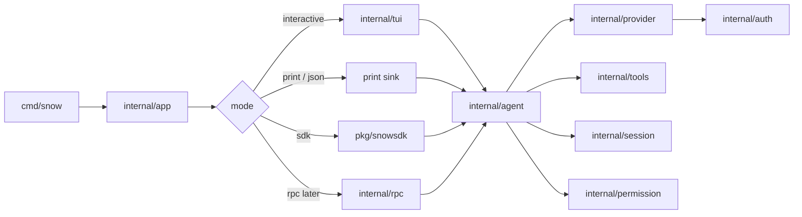
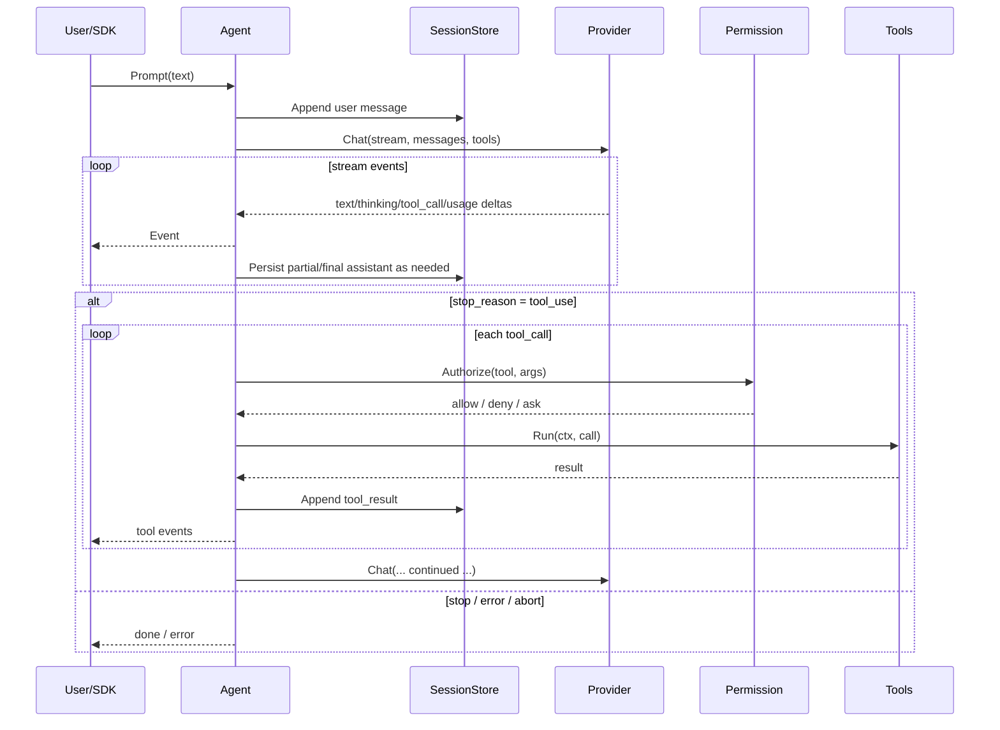

# snow-core — Implementation Research & Technical Design

> **Status:** Decision-complete design. No application code yet.  
> **Binary:** `snow`  
> **Module (placeholder):** `github.com/snow-core/snow`  
> **Language:** Go  
> **Surfaces:** Interactive TUI · print/JSON stream · embeddable SDK · RPC (phase 3+)  
> **Auth MVP:** OpenCode Go (API key) · ChatGPT Plus/Pro Codex OAuth  

This document is the single source of truth for building **snow-core**: a standalone, modular, efficient coding-agent harness inspired by pi, OpenCode, and Codex—written in Go with a TUI and SDK.

---

## Table of contents

1. [Overview](#1-overview)
2. [Architecture](#2-architecture)
3. [Public interfaces](#3-public-interfaces)
4. [Built-in tools](#4-built-in-tools)
5. [Auth and providers](#5-auth-and-providers)
6. [TUI](#6-tui)
7. [SDK](#7-sdk)
8. [Config and project context](#8-config-and-project-context)
9. [Security model](#9-security-model)
10. [Plugin and modularity model](#10-plugin-and-modularity-model)
11. [Repo bootstrap](#11-repo-bootstrap)
12. [Phased roadmap](#12-phased-roadmap)
13. [Testing and verification](#13-testing-and-verification)
14. [Research appendix](#14-research-appendix)
15. [Open risks and mitigations](#15-open-risks-and-mitigations)
16. [Glossary](#16-glossary)

---

## 1. Overview

### 1.1 Problem

Coding-agent harnesses today tend to fall into one of three traps:

| Trap | Examples of pressure | Cost |
|------|----------------------|------|
| **Heavy product surface** | Large Electron shells, many product modes | Slow iteration, hard to embed, high memory |
| **Hard to embed** | CLI-only with no stable library API | Every host reimplements the agent loop |
| **JS/TS-centric runtime** | Node agent cores | Higher baseline RAM/CPU; weaker single-binary story |

Builders who want a **small, fast, embeddable** harness with **subscription + API-key auth** often have to fork a large project or glue provider SDKs by hand.

### 1.2 Vision

**snow** is a minimal terminal coding harness and library:

- **Small Go core** — agent loop, sessions, tools, providers, permissions.
- **Streaming-first** — tokens and tool events flow to TUI/SDK without buffering full turns.
- **Pluggable edges** — providers and tools behind interfaces; optional JSON-RPC subprocess plugins.
- **Charm-style TUI** — interactive default UX.
- **Pure-Go SDK** — same core as the CLI; no duplicated loop.
- **Auth that matches real usage** — OpenCode Go API key and ChatGPT Plus/Pro (Codex) OAuth in MVP.

Philosophy (pi-aligned, Go-native):

> Ship powerful defaults. Keep the core small. Extend at the edges. Do not force product workflows (multi-agent, plan mode, memory DB) into v1.

### 1.3 Competitive map

| System | Take | Reject / defer |
|--------|------|----------------|
| **pi** | Minimal core; JSONL tree sessions; SDK = same loop as CLI; project trust ≠ sandbox; four core tools; slash commands; event subscribe model | TypeScript extension VM; huge provider catalog day one; package ecosystem |
| **OpenCode** | Event-rich runtime ideas; permission ask/allow/deny; provider/model listing patterns; OpenCode Go as a first-class paid route | Becoming an OpenCode client; Electron; full plugin marketplace |
| **Codex / ChatGPT sub** | OAuth subscription path for Plus/Pro; “Codex for OSS” posture; browser login + headless paste fallback | Depending on closed CLI internals; coupling UI to OpenAI’s product chrome |
| **snow-agent (sibling)** | Brand/UX taste for power users (optional later) | Any Electron/IPC contract in v1; snow-core is **standalone**, not snow-agent backend yet |

### 1.4 Goals

- Single static-ish Go binary (`snow`) for macOS/Linux (Windows best-effort later).
- Modular packages with **no UI imports** inside `agent` / `provider` / `session`.
- MVP auth: **OpenCode Go** + **ChatGPT Codex OAuth**.
- MVP tools: **read, write, edit, bash**.
- Surfaces: **TUI**, **print/JSON**, **SDK**; RPC mode documented for phase 3.
- Append-only **JSONL** sessions with tree branch (`id` / `parentId`).
- Clear permission + project-trust model; honest non-sandbox security story.

### 1.5 Non-goals (v1)

- snow-agent / Electron integration.
- Full pi/OpenCode provider catalog.
- Built-in OS sandbox or container runtime (document optional backends only).
- Multi-agent / subagent orchestration.
- Skills marketplace, theme marketplace, WASM extension runtime.
- Local vector memory DB, notes/tasks product surfaces.
- Guaranteeing ToS-proof reverse-engineering of undocumented endpoints (isolate adapters; prefer official Codex-for-OSS guidance).

### 1.6 Success criteria (product)

| Metric | Target |
|--------|--------|
| TUI cold start to editable prompt | **&lt; 100ms** on warm machine (no network) |
| Binary | One primary CLI; SDK is a library import |
| Auth | Both MVP providers complete a real multi-turn tool loop |
| Tools | read / write / edit / bash with path + permission gates |
| Embed | `pkg/snowsdk` can run headless prompt + event subscribe without TUI |
| Core size | Agent loop understandable in one package; extensions optional |

---

## 2. Architecture

### 2.1 Package map

```
github.com/snow-core/snow
├── cmd/snow                 # CLI entry (cobra)
├── internal/
│   ├── app                  # wire-up: config, auth, session, agent, mode select
│   ├── agent                # turn loop, tool dispatch, abort, retries
│   ├── provider             # Provider/Model/Stream + adapters
│   │   ├── opencodego       # OpenCode Go adapter
│   │   └── chatgpt          # ChatGPT / Codex OAuth adapter
│   ├── auth                 # credential store, OAuth browser/device flows
│   ├── tools                # Tool interface, builtins, RPC host
│   │   └── builtin          # read, write, edit, bash (, grep, glob later)
│   ├── session              # JSONL tree store, fork/resume/list
│   ├── context              # AGENTS.md discovery, system prompt assembly
│   ├── compact              # context compaction
│   ├── permission           # ask / allow / deny
│   ├── config               # global + project settings
│   ├── event                # typed events for TUI/SDK/RPC
│   ├── tui                  # bubbletea app
│   └── rpc                  # JSONL stdin/stdout mode (phase 3+)
└── pkg/
    ├── snowsdk              # public embed API (stable surface)
    └── protocol             # shared message/event DTOs if needed outside internal
```

**Import rules**

| Package | May import | Must not import |
|---------|------------|-----------------|
| `agent` | provider, tools, session, permission, event, context, compact | `tui`, `cmd`, `rpc` UI |
| `provider/*` | auth, config, protocol | tools, tui, agent |
| `tools` | permission, config | provider, tui |
| `tui` | event, app facades, config | provider HTTP details |
| `snowsdk` | internal via thin facades **or** duplicated stable types in `pkg/protocol` | bubbletea |
| `cmd/snow` | everything for wire-up | — |

Prefer **`pkg/protocol` + `pkg/snowsdk`** as the only stable external API. Everything under `internal/` can move freely.

### 2.2 Runtime modes



### 2.3 Core turn loop



**Loop invariants**

1. Every accepted user prompt gets a session entry before the first provider call (crash-safe intent).
2. Assistant messages are finalized with `stop_reason` before tool execution batch commits (or use explicit `pending` only in-memory, never as durable terminal state).
3. Tool results always reference `tool_call_id`.
4. `context.Context` cancellation aborts provider stream **and** in-flight tools.
5. Events are the only cross-surface observation channel (TUI/SDK/print/RPC all subscribe).

### 2.4 Efficiency principles

| Principle | Practice |
|-----------|----------|
| Single binary | Avoid CGo; keep deps lean; Charm + stdlib HTTP |
| Stream, don’t buffer | Provider adapters yield deltas; TUI paints incrementally |
| Append-only sessions | JSONL; no DB in MVP; O(1) append, scan on load |
| Bound tool output | Truncate stdout/stderr and read payloads with clear markers |
| Cancel everywhere | `ctx` on HTTP, bash, file IO timeouts |
| Segregate packages | UI never blocks provider decode on render lock longer than one frame |
| Cheap default tools | Prefer pure-Go `grep`/`glob` in phase 1.5 over shelling out |
| Plugins are cold | Subprocess plugins opt-in; document startup cost |
| Usage from provider | MVP trusts provider token usage; no local tokenizer required |

### 2.5 Dependency direction (summary)

```
cmd → app → {tui | print | rpc}
app → agent → {provider, tools, session, permission, context, compact, event}
provider → auth
snowsdk → app/agent facades + protocol
```

---

## 3. Public interfaces

Signatures below are **decision-complete sketches** (names may shift slightly at implement time; responsibilities must not).

### 3.1 Messages and content blocks

```go
// pkg/protocol/message.go (conceptual)

type Role string

const (
    RoleUser      Role = "user"
    RoleAssistant Role = "assistant"
    RoleTool      Role = "tool_result"
    RoleSystem    Role = "system"  // rare; prefer context assembly
    RoleCustom    Role = "custom"  // extensions / harness notes
)

type ContentBlock struct {
    Type string `json:"type"` // text | image | thinking | tool_call

    // text / thinking
    Text string `json:"text,omitempty"`

    // image
    MIMEType string `json:"mime_type,omitempty"`
    Data     []byte `json:"data,omitempty"` // base64 in JSONL on disk

    // tool_call
    ToolCallID string          `json:"tool_call_id,omitempty"`
    Name       string          `json:"name,omitempty"`
    Arguments  json.RawMessage `json:"arguments,omitempty"`
}

type Message struct {
    ID        string         `json:"id"`
    ParentID  string         `json:"parent_id,omitempty"`
    Role      Role           `json:"role"`
    Content   []ContentBlock `json:"content"`
    Timestamp int64          `json:"ts"` // unix ms

    // assistant metadata
    Provider   string      `json:"provider,omitempty"`
    Model      string      `json:"model,omitempty"`
    StopReason string      `json:"stop_reason,omitempty"` // stop|length|tool_use|error|aborted
    Error      string      `json:"error,omitempty"`
    Usage      *Usage      `json:"usage,omitempty"`

    // tool_result metadata
    ToolCallID string `json:"tool_call_id,omitempty"`
    ToolName   string `json:"tool_name,omitempty"`
    IsError    bool   `json:"is_error,omitempty"`
}

type Usage struct {
    Input      int `json:"input"`
    Output     int `json:"output"`
    CacheRead  int `json:"cache_read"`
    CacheWrite int `json:"cache_write"`
    Total      int `json:"total_tokens"`
    Cost       *Cost `json:"cost,omitempty"`
}

type Cost struct {
    Input      float64 `json:"input"`
    Output     float64 `json:"output"`
    CacheRead  float64 `json:"cache_read"`
    CacheWrite float64 `json:"cache_write"`
    Total      float64 `json:"total"`
}
```

### 3.2 Provider stream

```go
type Model struct {
    Provider         string
    ID               string
    DisplayName      string
    ContextWindow    int
    MaxOutputTokens  int
    SupportsTools    bool
    SupportsThinking bool
    SupportsVision   bool
}

type ChatRequest struct {
    Model        Model
    Messages     []Message
    Tools        []ToolSchema
    System       string
    MaxTokens    int
    Temperature  *float64
    Thinking     ThinkingLevel // off|minimal|low|medium|high
    // provider-specific extras isolated in adapter options
}

type StreamEventType string

const (
    EvStreamTextDelta     StreamEventType = "text_delta"
    EvStreamThinkingDelta StreamEventType = "thinking_delta"
    EvStreamToolCallDelta StreamEventType = "tool_call_delta"
    EvStreamToolCallDone  StreamEventType = "tool_call_done"
    EvStreamUsage         StreamEventType = "usage"
    EvStreamDone          StreamEventType = "done"
    EvStreamError         StreamEventType = "error"
)

type StreamEvent struct {
    Type       StreamEventType
    Text       string
    ToolCallID string
    ToolName   string
    Arguments  json.RawMessage // cumulative or final per adapter contract
    Usage      *Usage
    StopReason string
    Err        error
}

type EventStream interface {
    // Next blocks until the next event or EOF/error.
    Next(ctx context.Context) (StreamEvent, error)
    Close() error
}

type Provider interface {
    ID() string
    ListModels(ctx context.Context) ([]Model, error)
    // Resolve ensures credentials are valid (refresh OAuth if needed).
    Resolve(ctx context.Context, creds auth.Credential) error
    Chat(ctx context.Context, creds auth.Credential, req ChatRequest) (EventStream, error)
}
```

**Adapter contract:** each provider normalizes vendor SSE/JSON into `StreamEvent`. Tool-call argument streaming may be vendor-specific; adapters must emit a final `tool_call_done` with complete JSON arguments before the agent dispatches tools.

### 3.3 Tools

```go
type ToolSchema struct {
    Name        string          `json:"name"`
    Description string          `json:"description"`
    Parameters  json.RawMessage `json:"parameters"` // JSON Schema object
}

type ToolResult struct {
    Content []ContentBlock
    IsError bool
    // Details is tool-private metadata for TUI (e.g. diff stats); not sent to the model unless mirrored into Content.
    Details any
}

type ToolHost interface {
    CWD() string
    // Roots returns path roots the tool may touch (cwd + explicit allows).
    Roots() []string
    Permission() permission.Service
    EmitProgress(event ToolProgressEvent)
    Environ() []string
}

type Tool interface {
    Schema() ToolSchema
    Run(ctx context.Context, args json.RawMessage, host ToolHost) (ToolResult, error)
}

type Registry interface {
    Register(Tool) error
    Get(name string) (Tool, bool)
    Schemas() []ToolSchema
    List() []Tool
}
```

### 3.4 Session store

```go
type SessionHeader struct {
    Version   int    `json:"v"` // current: 1
    ID        string `json:"id"`
    CreatedAt int64  `json:"created_at"`
    CWD       string `json:"cwd"`
    Name      string `json:"name,omitempty"`
}

// File is JSONL: line0 header wrapper, then entry lines.
type Entry struct {
    Type     string  `json:"type"` // message | compaction | meta
    ID       string  `json:"id"`
    ParentID string  `json:"parent_id,omitempty"`
    Message  *Message `json:"message,omitempty"`
    // compaction fields...
}

type SessionStore interface {
    ID() string
    Path() string // empty if in-memory
    Header() SessionHeader

    Append(entry Entry) error
    // BranchTip returns the active leaf id.
    BranchTip() string
    // SetBranchTip moves the active cursor (tree navigation).
    SetBranchTip(id string) error
    // Messages returns linearized messages from root → tip.
    Messages() ([]Message, error)
    Fork(fromID string) (SessionStore, error)
    Close() error
}

type SessionIndex interface {
    List(cwd string) ([]SessionInfo, error)
    Open(path string) (SessionStore, error)
    Create(cwd string) (SessionStore, error)
}
```

**On-disk layout**

```
~/.snow/sessions/--<cwd-encoded>--/<timestamp>_<uuid>.jsonl
```

`cwd-encoded`: absolute path with `/` → `-` (pi-like). Schema is **snow-owned** (`v` field); do not claim pi compatibility.

### 3.5 Agent

```go
type Agent interface {
    Prompt(ctx context.Context, text string, opts ...PromptOption) error
    Steer(ctx context.Context, text string) error     // mid-run queue (phase 2+)
    FollowUp(ctx context.Context, text string) error  // after run (phase 2+)
    Abort(ctx context.Context) error
    Subscribe(func(AgentEvent)) (unsubscribe func)

    SetModel(model Model) error
    SetThinking(level ThinkingLevel)
    Model() Model
    Messages() []Message
    IsRunning() bool
}

type AgentEvent struct {
    Type string // session_updated | text_delta | thinking_delta | tool_start |
                // tool_progress | tool_end | permission_request | usage |
                // turn_done | error | aborted
    // payload fields omitted — see pkg/protocol/events.go
}
```

### 3.6 Permission

```go
type Mode string // ask | allow | deny

type Request struct {
    Tool   string
    Args   json.RawMessage
    Paths  []string // affected paths if known
    Risk   string   // read|write|exec|network
    Reason string
}

type Decision string // allow | deny | allow_session | allow_always

type Service interface {
    Mode() Mode
    SetMode(Mode)
    // Authorize blocks when mode=ask and no cached rule matches.
    Authorize(ctx context.Context, req Request) (Decision, error)
    Remember(req Request, d Decision) // session or persistent scope
}
```

Interactive TUI supplies an `Asker`; headless SDK defaults to `deny` for mutating tools unless `Options.PermissionMode` or auto-approve is set.

### 3.7 Auth store

```go
type CredentialType string // api_key | oauth

type Credential struct {
    Provider string          `json:"-"`
    Type     CredentialType  `json:"type"`
    Key      string          `json:"key,omitempty"`
    Access   string          `json:"access,omitempty"`
    Refresh  string          `json:"refresh,omitempty"`
    Expires  int64           `json:"expires,omitempty"` // unix seconds
    Extra    map[string]any  `json:"extra,omitempty"`
}

type Store interface {
    Get(provider string) (Credential, bool)
    Put(provider string, cred Credential) error
    Delete(provider string) error
    // Path for diagnostics (never print secrets).
    Path() string
}
```

---

## 4. Built-in tools

### 4.1 MVP set

| Tool | Purpose | Permission risk | Notes |
|------|---------|-----------------|-------|
| `read` | Read file contents (optional offset/limit) | read | Binary → short error; large file truncate |
| `write` | Create/overwrite file | write | Creates parents; show diff intent in TUI |
| `edit` | Exact string replace / patch | write | Fail if `old_str` not unique unless `replace_all` |
| `bash` | Run shell command in cwd | exec | Timeout; combined output bound; no implicit network policy |

### 4.2 Phase 1.5 pure-Go tools

| Tool | Purpose |
|------|---------|
| `grep` | Ripgrep-like content search (Go impl or optional external `rg`) |
| `glob` | Fast file path matching |

These reduce bash round-trips and improve Windows behavior.

### 4.3 Schemas (conceptual)

**read**

```json
{
  "name": "read",
  "description": "Read a UTF-8 text file within allowed roots.",
  "parameters": {
    "type": "object",
    "required": ["path"],
    "properties": {
      "path": { "type": "string" },
      "offset": { "type": "integer", "description": "1-based start line" },
      "limit": { "type": "integer", "description": "max lines" }
    }
  }
}
```

**write**

```json
{
  "name": "write",
  "parameters": {
    "type": "object",
    "required": ["path", "content"],
    "properties": {
      "path": { "type": "string" },
      "content": { "type": "string" }
    }
  }
}
```

**edit**

```json
{
  "name": "edit",
  "parameters": {
    "type": "object",
    "required": ["path", "old_str", "new_str"],
    "properties": {
      "path": { "type": "string" },
      "old_str": { "type": "string" },
      "new_str": { "type": "string" },
      "replace_all": { "type": "boolean", "default": false }
    }
  }
}
```

**bash**

```json
{
  "name": "bash",
  "parameters": {
    "type": "object",
    "required": ["command"],
    "properties": {
      "command": { "type": "string" },
      "timeout_ms": { "type": "integer", "default": 120000 }
    }
  }
}
```

### 4.4 Safety behaviors (all tools)

1. **Path confinement:** resolve symlinks; require final path under `Roots()` (cwd + configured allows).
2. **Deny escape:** `..` and symlink escapes return `IsError` without throwing panics.
3. **Output caps:** default e.g. 256 KiB per tool result to the model; store full artifact path in `Details` if truncated.
4. **Secrets:** redaction hooks optional later; never echo auth file contents.
5. **bash:** `Setpgid` / process group kill on cancel (Unix); document weaker Windows cancel.
6. **write/edit:** optional backup sibling `.snow-bak` **off** by default (explicit config).

### 4.5 Tool dispatch policy

- Parallel tool calls: **serial in MVP** (simpler permissions + FS races); parallel opt-in later for read-only tools.
- Unknown tool name → `tool_result` error string, not hard crash.
- Panic in tool → recovered to error result.

---

## 5. Auth and providers

### 5.1 Credential file

**Path:** `~/.snow/auth.json`  
**Permissions:** `0600` (create/truncate with user-only mode)

```json
{
  "opencode-go": {
    "type": "api_key",
    "key": "oc-..."
  },
  "chatgpt": {
    "type": "oauth",
    "access": "...",
    "refresh": "...",
    "expires": 1730000000,
    "extra": {
      "account_id": "optional"
    }
  }
}
```

### 5.2 Resolution order

For a provider P:

1. Explicit CLI flag / SDK option (`--api-key`, `Options.Credential`)
2. `auth.json` entry for P
3. Environment variable for P
4. Else: interactive `/login` (TUI) or error (headless)

| Provider | Env var | auth.json key |
|----------|---------|---------------|
| OpenCode Go | `OPENCODE_API_KEY` | `opencode-go` |
| ChatGPT Codex | *(none for OAuth)* | `chatgpt` |

> Note: pi stores OpenCode Go under `opencode-go` and also accepts `OPENCODE_API_KEY` shared with OpenCode Zen. snow MVP **only** wires OpenCode Go; do not silently alias Zen models unless added later.

### 5.3 OpenCode Go (API key)

**Role:** primary API-key provider for MVP.

| Item | Decision |
|------|----------|
| Provider ID | `opencode-go` |
| Auth | Bearer API key |
| Wire protocol | Assume **OpenAI-compatible** Chat Completions **or** Responses API — **verify at implement time** (see checklist) |
| Base URL | Discover from current OpenCode Go docs/dashboard at implement time; keep `base_url` in config override |
| Default model | Pin after catalog probe (pi currently defaults something like `kimi-k2.6` for opencode-go — **do not hardcode without verify**) |
| Streaming | SSE `text/event-stream` preferred |
| Tools | OpenAI-style `tools` / `tool_calls` normalized to snow events |

**Adapter responsibilities**

- Attach `Authorization: Bearer <key>`.
- Map stream chunks → `StreamEvent`.
- Map finish reasons → `stop|length|tool_use|error`.
- Surface rate-limit / quota errors as structured `EvStreamError`.
- Optional: fetch remote model catalog; cache under `~/.snow/models-cache.json`.

**Config knobs**

```json
{
  "providers": {
    "opencode-go": {
      "base_url": "https:///* verify */",
      "default_model": "/* verify */",
      "api_key_env": "OPENCODE_API_KEY"
    }
  }
}
```

### 5.4 ChatGPT Plus/Pro (Codex OAuth)

**Role:** subscription path for users with ChatGPT Plus/Pro via Codex-for-OSS compatible auth.

| Item | Decision |
|------|----------|
| Provider ID | `chatgpt` |
| Auth | OAuth2 authorization code + PKCE (browser) with **paste-redirect fallback** for SSH |
| Token storage | `auth.json` oauth fields; auto-refresh on 401/expiry |
| API | Codex / ChatGPT harness endpoints as documented for OSS clients — **adapter-isolated** |
| Models | Catalog from auth-capable endpoint or static allowlist refreshed in code bumps |

**Login UX (`/login chatgpt`)**

1. Generate PKCE verifier/challenge + state.
2. Open system browser to authorize URL (or print URL).
3. Localhost callback server (`127.0.0.1:<ephemeral>`) receives code **or** user pastes final redirect URL/code.
4. Exchange code → access + refresh; write `auth.json` mode `0600`.
5. Validate with a lightweight models/me call.
6. On success, set as active provider if none.

**Logout:** delete `chatgpt` key; cancel refresh timers.

**Refresh:** before `Chat`, if `expires < now+60s`, refresh; on failure mark credential invalid and emit actionable error.

#### Compliance and risk (explicit)

- Follow **OpenAI Codex for OSS** guidance; this harness is a third-party client.
- Do not scrape undocumented web chat APIs if an official OSS path exists.
- Subscription benefits, rate limits, and ToS can change; isolate all HTTP paths in `internal/provider/chatgpt`.
- Document in README: user is responsible for account eligibility (Plus/Pro) and acceptable use.
- Never log access/refresh tokens.

### 5.5 Provider registry

```go
registry.Register(opencodego.New(cfg))
registry.Register(chatgpt.New(cfg, oauthRunner))
```

CLI `--provider opencode-go --model <id>` and TUI `/model` both resolve through the same registry.

### 5.6 Implementation-time verify checklist (providers)

Must be completed in Phase 1–2 coding, results folded into adapter constants/tests:

- [ ] OpenCode Go base URL(s) and auth header scheme
- [ ] OpenCode Go streaming endpoint path (chat completions vs responses)
- [ ] OpenCode Go tool-call streaming shape
- [ ] OpenCode Go default + available model IDs
- [ ] ChatGPT/Codex OAuth authorize/token URLs and client id requirements for OSS
- [ ] ChatGPT/Codex required headers (e.g. account/session headers if any)
- [ ] ChatGPT/Codex model IDs allowed on subscription
- [ ] Error body shapes for quota/auth failures
- [ ] Whether cache token fields exist for usage mapping

---

## 6. TUI

### 6.1 Stack

| Library | Use |
|---------|-----|
| [`charmbracelet/bubbletea`](https://github.com/charmbracelet/bubbletea) | Elm-architecture TUI runtime |
| [`charmbracelet/lipgloss`](https://github.com/charmbracelet/lipgloss) | Style / layout |
| [`charmbracelet/bubbles`](https://github.com/charmbracelet/bubbles) | Textarea, viewport, spinner, list |
| [`charmbracelet/glamour`](https://github.com/charmbracelet/glamour) | Markdown render (assistant messages) |
| [`charmbracelet/huh`](https://github.com/charmbracelet/huh) optional | Forms for login/permissions |

### 6.2 Layout

```
┌──────────────────────────────────────────────────────────┐
│ header (optional): version, shortcuts hint               │
├──────────────────────────────────────────────────────────┤
│                                                          │
│  transcript (viewport)                                   │
│   - user bubbles                                         │
│   - assistant markdown + thinking fold                   │
│   - tool cards (name, status, truncated output)          │
│   - errors / notifications                               │
│                                                          │
├──────────────────────────────────────────────────────────┤
│  permission modal / model picker (overlays when active)  │
├──────────────────────────────────────────────────────────┤
│  editor (textarea)                                       │
│  multi-line; paste; @ file path completion (phase 2)     │
├──────────────────────────────────────────────────────────┤
│  footer: cwd · session · provider/model · tokens · state │
└──────────────────────────────────────────────────────────┘
```

### 6.3 Slash commands (MVP → phase 2)

| Command | Phase | Behavior |
|---------|-------|----------|
| `/login` | 1–2 | Provider picker; API key prompt or OAuth |
| `/logout` | 2 | Clear provider creds |
| `/model` | 1 | Fuzzy select model |
| `/new` | 1 | New session |
| `/resume` | 2 | Pick prior session |
| `/name` | 2 | Set display name |
| `/permission` | 2 | ask/allow/deny |
| `/compact` | 2 | Manual compaction |
| `/session` | 2 | Paths, counts, usage |
| `/quit` | 1 | Exit |

### 6.4 Keybindings (defaults)

| Key | Action |
|-----|--------|
| `enter` | Send (single-line mode) / send if configured |
| `ctrl+j` or `shift+enter` | Newline (terminal-dependent) |
| `ctrl+c` | Abort running turn; second press quit if idle |
| `ctrl+d` | Quit on empty editor |
| `ctrl+l` | `/model` |
| `pgup/pgdn` | Transcript scroll |

Phase 2: `~/.snow/keybindings.json` overrides.

### 6.5 Event → UI mapping

| AgentEvent | UI |
|------------|----|
| `text_delta` | Append to live assistant buffer |
| `thinking_delta` | Append to folded thinking region |
| `tool_start` | Open tool card (running) |
| `tool_end` | Finalize card (ok/err) |
| `permission_request` | Modal; block tool until decision |
| `usage` | Footer counters |
| `turn_done` | Unlock editor; finalize bubbles |
| `error` | Error banner |

**Performance:** coalesce text deltas per animation frame (~16–32ms) to avoid per-token `View()` thrash.

### 6.6 Themes

MVP: one dark default (snow-agent-inspired slate + coral accent optional).  
Phase 4: `~/.snow/themes/*.json` lipgloss token maps.

---

## 7. SDK

### 7.1 Goals

- Embed the **same** agent loop as the CLI.
- No bubbletea dependency in the hot path of library consumers.
- Stable event types versioned in `pkg/protocol`.

### 7.2 Surface

```go
package snowsdk

type Options struct {
    CWD             string
    Provider        string
    Model           string
    SessionPath     string // empty → ephemeral memory
    AuthPath        string // default ~/.snow/auth.json
    ConfigPath      string
    PermissionMode  string // ask|allow|deny; default deny for mutating in non-TTY
    AutoApprove     bool   // dangerous; for trusted CI only
    Tools           []string // subset allowlist; empty = defaults
    SystemPrompt    string
    Thinking        string
    // Credential overrides...
}

type Session struct { /* opaque */ }

func Open(ctx context.Context, opts Options) (*Session, error)

func (s *Session) Prompt(ctx context.Context, text string) error
func (s *Session) Abort(ctx context.Context) error
func (s *Session) Subscribe(func(protocol.AgentEvent)) (cancel func)
func (s *Session) Model() protocol.Model
func (s *Session) SetModel(protocol.Model) error
func (s *Session) Messages() []protocol.Message
func (s *Session) Close() error
```

### 7.3 Example

```go
s, err := snowsdk.Open(ctx, snowsdk.Options{
    CWD:            ".",
    Provider:       "opencode-go",
    PermissionMode: "allow", // careful
})
if err != nil { log.Fatal(err) }
defer s.Close()

s.Subscribe(func(ev protocol.AgentEvent) {
    if ev.Type == "text_delta" {
        fmt.Print(ev.Text)
    }
})

if err := s.Prompt(ctx, "List Go files and summarize main packages."); err != nil {
    log.Fatal(err)
}
```

### 7.4 Print / JSON CLI mode

```bash
snow -p "fix the build" --provider opencode-go
snow --mode json -p "..."    # JSONL events to stdout
```

JSON event lines mirror `protocol.AgentEvent` for easy piping.

### 7.5 RPC mode (phase 3)

JSONL over stdin/stdout (pi-inspired):

- Commands: `prompt`, `abort`, `set_model`, `authorize_response`, …
- Events: same as SDK events  
- Framing: split on `\n` only (not Unicode line separators)

Primary consumers: non-Go hosts, IDE bridges. Go hosts should prefer `snowsdk`.

---

## 8. Config and project context

### 8.1 Paths

| Path | Purpose |
|------|---------|
| `~/.snow/config.json` | Global settings |
| `~/.snow/auth.json` | Secrets |
| `~/.snow/trust.json` | Project trust decisions |
| `~/.snow/sessions/` | JSONL sessions |
| `~/.snow/models-cache.json` | Cached catalogs |
| `~/.snow/keybindings.json` | Phase 2 |
| `<project>/AGENTS.md` | Always-on project instructions (if present) |
| `<project>/.snow/config.json` | Project settings (trust-gated) |
| `<project>/.snow/plugins/*` | Phase 4 plugin manifests (trust-gated) |

### 8.2 Global config shape (MVP)

```json
{
  "default_provider": "opencode-go",
  "default_model": "",
  "permission_mode": "ask",
  "default_project_trust": "ask",
  "thinking": "off",
  "tool_output_bytes": 262144,
  "bash_timeout_ms": 120000,
  "providers": {
    "opencode-go": { "base_url": "", "default_model": "" },
    "chatgpt": { "default_model": "" }
  },
  "tui": {
    "theme": "default",
    "mouse": false
  }
}
```

### 8.3 Context assembly order

1. Built-in system preamble (tools, style, safety short rules).
2. Global user instructions if configured.
3. `AGENTS.md` walk: cwd → parents (cap depth / total bytes).
4. Optional `CLAUDE.md` compatibility read (**off** by default; config gate).
5. Project `.snow` append system (trust-gated).
6. Per-turn SDK/CLI system override.

Hard cap total injected context (e.g. 100 KiB) with truncation notice.

### 8.4 Project trust

Mirrors pi’s *input-loading guard*, **not** a sandbox.

**When prompted:** project contains trust-sensitive resources (`.snow/config.json`, plugins, etc.).

**Decisions:** store canonical path → `allow` | `deny` in `~/.snow/trust.json`.

**Headless:** `default_project_trust: ask` behaves as **deny** unless `--trust` / config `always`.

**Always loaded without trust:** `AGENTS.md` (documented residual prompt-injection risk).

---

## 9. Security model

### 9.1 Boundary statement

snow runs **as the user**. Built-in tools can read/write files and execute commands with the process’s OS permissions. There is **no** in-process sandbox in v1.

### 9.2 Controls we do implement

| Control | Protects against |
|---------|------------------|
| Project trust | Silent malicious project config/plugins |
| Permission mode | Unreviewed write/exec tool calls |
| Path roots | Casual path escape from tools |
| auth.json 0600 | Casual local secret read by other users |
| No secret logging | Token leakage in debug output |
| Truncation | Context blow-ups from huge tool dumps |

### 9.3 Residual risks (accepted)

- Prompt injection via repo files, `AGENTS.md`, tool output.
- Malicious bash once allowed.
- OAuth tokens on disk stolen by malware running as user.
- Supply-chain risk in dependencies and external plugins.

### 9.4 Recommendations (docs/README)

- Use disposable credentials when possible.
- Run untrusted repos in a VM/container.
- Prefer `permission_mode: ask` interactively.
- Never set `AutoApprove` in SDK on untrusted input.

### 9.5 Future isolation backends (not MVP)

- Tool execution via Docker/bubblewrap supervisor.
- Network-less bash profile.
- Separate subprocess FS worker with seccomp (Linux).

---

## 10. Plugin and modularity model

### 10.1 Locked decision

| Layer | Mechanism |
|-------|-----------|
| Core builtins | Go `Tool` / `Provider` interfaces, in-process |
| Optional external capabilities | **JSON-RPC over stdio** subprocess plugins |
| Explicitly avoided as primary | `plugin.Open` Go `.so` shared libraries (portability/pain) |
| Skills (phase 4) | Markdown playbooks, not executable code |

### 10.2 In-process registration

```go
func RegisterBuiltins(r tools.Registry) {
    r.Register(builtin.NewRead())
    r.Register(builtin.NewWrite())
    r.Register(builtin.NewEdit())
    r.Register(builtin.NewBash())
}
```

Build tags may exclude heavy adapters for minimal binaries later (`//go:build chatgpt`).

### 10.3 Subprocess plugin protocol (phase 3–4)

**Transport:** JSONL on plugin stdin/stdout; stderr for logs.

**Handshake**

```json
{"jsonrpc":"2.0","id":1,"method":"initialize","params":{"protocol_version":1,"cwd":"..."}}
{"jsonrpc":"2.0","id":1,"result":{"name":"my-plugin","version":"0.1.0","tools":[...]}}
```

**Methods**

| Method | Direction | Purpose |
|--------|-----------|---------|
| `initialize` | host→plugin | Negotiate version |
| `tools/list` | host→plugin | Schemas |
| `tools/call` | host→plugin | Invoke |
| `tools/progress` | plugin→host | Progress notifications |
| `shutdown` | host→plugin | Clean exit |

**Isolation benefits:** crash containment, any language plugins, optional tighter OS sandbox around the child.

**Costs:** cold start, serialization, harder shared FS locks — keep off the MVP path.

### 10.4 What is not a plugin

- Themes, keybindings, model lists → config.
- Skills/prompts → markdown expansion.
- Compaction strategies → internal interfaces first.

---

## 11. Repo bootstrap

### 11.1 Target tree (when coding starts)

```
snow-core/
  IMPLEMENTATION.md          # this file
  README.md
  go.mod
  go.sum
  cmd/snow/main.go
  internal/app/
  internal/agent/
  internal/provider/
  internal/provider/opencodego/
  internal/provider/chatgpt/
  internal/auth/
  internal/tools/
  internal/tools/builtin/
  internal/session/
  internal/context/
  internal/compact/
  internal/permission/
  internal/config/
  internal/event/
  internal/tui/
  internal/rpc/              # phase 3
  pkg/snowsdk/
  pkg/protocol/
  testdata/
  scripts/
  .gitignore
```

### 11.2 Suggested dependencies

| Dep | Why |
|-----|-----|
| `github.com/spf13/cobra` | CLI |
| `github.com/charmbracelet/bubbletea` | TUI |
| `github.com/charmbracelet/lipgloss` | Style |
| `github.com/charmbracelet/bubbles` | Components |
| `github.com/charmbracelet/glamour` | Markdown |
| `golang.org/x/oauth2` | OAuth helpers |
| `github.com/google/uuid` | IDs |
| `github.com/tidwall/gjson` / `sjson` optional | Fast JSON surgery for streams |

Avoid: heavy ORMs, full cloud SDKs when raw HTTP + SSE suffices.

### 11.3 Go version

- Minimum: **Go 1.22+** (or current stable at bootstrap).
- Enable: `go test ./...`, race detector in CI later.

### 11.4 Module path

Placeholder: `github.com/snow-core/snow`  
Replace with the real GitHub/Git path at first `go mod init` without redesign.

---

## 12. Phased roadmap

### Phase 0 — Spec and skeleton

**Deliverables**

- [x] `IMPLEMENTATION.md` (this document)
- [x] `go.mod`, `cmd/snow` stub printing version
- [x] `pkg/protocol` types
- [x] Interface files compiling with `fake` provider
- [x] In-memory session store + unit tests
- [x] README: vision, non-goals, how to run tests

**Exit criteria:** `go test ./...` green; no network.

---

### Phase 1 — Vertical slice

**Deliverables**

- [x] Agent loop with serial tool dispatch
- [x] JSONL session persistence (create/load tip)
- [x] Tools: `read`, `bash` (write/edit can stub deny)
- [x] Provider: **OpenCode Go** streaming chat + tools
- [x] Auth: API key from env + `auth.json`
- [x] Print mode: `snow -p "..."` 
- [x] Basic TUI: transcript + editor + footer + `/model` `/new` `/quit`
- [x] System prompt + `AGENTS.md` load
- [x] Context cancel / ctrl+c abort

**Acceptance tests**

- Fake provider scripted tool-call round-trip unit test.
- Manual: OpenCode Go key lists files via model+`bash`/`read` in a sample repo.
- Session file reloads and continues tip.

---

### Phase 2 — ChatGPT OAuth, mutations, permissions

**Deliverables**

- [x] Tools: `write`, `edit` with path gates
- [x] Permission service (`ask`/`allow`/`deny`; TUI `/permission` command; headless default deny)
- [x] `/login` `/logout` for API key + **ChatGPT OAuth** (browser + paste) — API-key login/logout shipped as CLI subcommands; ChatGPT OAuth adapter pending live-credential verification
- [ ] Token refresh
- [x] `/resume` (pending), `/permission`, `/session`, `/name` — permission+session+trust shipped; resume/name pending
- [x] Compaction v1 (summarize old span → replace with summary entry) — v1 appends a summary entry; full span replacement is a documented phase-4 refinement
- [x] Project trust prompt + `trust.json` (store, parent-walk, `/trust` command; interactive prompt pending)
- [x] Permission `ask` mode — TUI interactive asker via `/allow` `/deny` (/allow always); headless defaults to deny

**Acceptance tests**

- OAuth login succeeds on Plus/Pro test account; second run uses refresh without browser.
- Write tool blocked in `deny`; prompted in `ask`; silent in `allow`.
- Compaction reduces message count; model still answers with summary context.

---

### Phase 3 — SDK polish, search tools, RPC

**Deliverables**

- [x] Public `pkg/snowsdk` stable enough for external sample
- [x] `grep` + `glob` builtins
- [x] `--mode json` event stream
- [x] RPC JSONL mode skeleton
- [x] Subprocess tool host (one example plugin) — `internal/plugin` JSON-RPC host + fake plugin test
- [x] Steer/follow-up queue (abort + re-prompt path; full steer queue pending)

**Acceptance tests**

- External module example `go run` against snowsdk.
- JSON mode parses with `jq`.
- Example Python/node RPC client sends `prompt` and prints deltas.

---

### Phase 4 — Extensibility and UX depth

**Deliverables**

- [ ] Skills + prompt templates (markdown)
- [ ] Themes + keybindings files
- [ ] Model catalog refresh/cache
- [ ] Fork/tree navigation (`/tree` lite)
- [ ] Optional sandbox backend design spike
- [ ] Windows path/bash story hardened

**Acceptance tests**

- Custom theme loads; skill expands via slash command.
- Plugin tool appears in schema and executes.

---

## 13. Testing and verification

### 13.1 Unit

| Area | Cases |
|------|-------|
| Session tree | append, branch tip, fork, reload JSONL |
| Path safety | symlink escape, outside root, unicode paths |
| Edit tool | unique/non-unique `old_str`, replace_all |
| Auth store | 0600 permissions, round-trip, delete |
| OAuth refresh | mock clock expiry |
| Event order | tool_start before tool_end; turn_done last |
| Permission | mode matrix + remember rules |

### 13.2 Integration

- `fake` provider with deterministic script:
  1. assistant tool_call read
  2. consume tool_result
  3. final text
- Temp dir workspace fixtures under `testdata/workspaces/`.

### 13.3 Manual

- TUI smoke on Terminal.app / iTerm / Ghostty / VS Code terminal.
- Real OpenCode Go key multi-turn edit.
- Real ChatGPT OAuth on local + SSH paste path.
- Abort mid-stream and mid-bash.

### 13.4 Benchmarks (phase 1+)

| Bench | Goal |
|-------|------|
| `TestTUIStartup` | &lt; 100ms to first frame (fake deps) |
| Stream lag | UI shows first delta &lt; 50ms after recv |
| Large session reload | 10k entries load &lt; 500ms |

### 13.5 CI (when repo is live)

```
go test ./...
go vet ./...
go test -race ./internal/...
```

No network in default CI unit jobs; optional nightly integration with secrets.

---

## 14. Research appendix

### 14.1 pi patterns worth copying

| Pattern | Why |
|---------|-----|
| Minimal core tools (read/write/edit/bash) | Forces good agent behavior; easy to reason about |
| JSONL session with tree `id`/`parentId` | Branch/resume without DB |
| SDK session = CLI core | No dual maintenance |
| Project trust ≠ sandbox | Honest security story |
| Event subscribe model | TUI/RPC/SDK share one bus |
| auth.json 0600 + env fallback | Simple operator UX |
| OpenCode Go as `OPENCODE_API_KEY` / `opencode-go` | Known user demand |

References (local install / upstream docs):

- pi README — modes: interactive, print/JSON, RPC, SDK
- `docs/session-format.md` — JSONL tree, message blocks, usage
- `docs/providers.md` — subscriptions vs API keys; OpenCode Go row
- `docs/sdk.md` — `createAgentSession`, subscribe, prompt
- `docs/security.md` — trust vs sandbox
- `docs/rpc.md` — JSONL framing pitfalls

### 14.2 OpenCode / snow-agent lessons

From the sibling **snow-agent** Electron app (OpenCode-hosted):

- Event coalescing matters for UI performance.
- Permission snapshots and ask/allow/deny are user-visible safety.
- Rich product features (memory DB, goal mode, research mode) explode scope — **keep out of snow-core v1**.
- snow-core should remain a **harness**, not a full IDE product.

### 14.3 Codex / ChatGPT subscription

- OpenAI publicly discusses **Codex for OSS** harness integration with ChatGPT subscription auth.
- pi implements ChatGPT Plus/Pro (Codex) via `/login` OAuth and stores tokens in auth.json.
- Implementation must track **current** official endpoints and client requirements; treat any community reverse-engineering as unstable.
- Mitigation: single adapter package + verify checklist + feature flag to disable chatgpt builds.

### 14.4 Go TUI ecosystem

Charmbracelet (Bubble Tea) is the de-facto standard for modern Go CLIs (gh-like UX). It fits streaming agent UIs via `Program.Send` from agent goroutines.

### 14.5 What “efficient” means here

| Axis | Choice |
|------|--------|
| Memory | Go single binary; stream processing; JSONL not SQLite MVP |
| CPU | Coalesced UI updates; serial tools MVP; pure-Go search later |
| Disk | Append-only logs; bounded tool output |
| Network | HTTP/2 keep-alive client per provider; cancelable streams |
| Extensibility tax | Pay subprocess cost only when plugins enabled |

---

## 15. Open risks and mitigations

| Risk | Impact | Mitigation |
|------|--------|------------|
| OpenCode Go API shape differs from OpenAI-compatible assumptions | Phase 1 blocked | Probe first day; isolate adapter; golden stream fixtures |
| ChatGPT OAuth / Codex endpoint churn | Login breaks | Adapter isolation; version pin notes; paste fallback; CI smoke with secret |
| ToS / account policy changes | Legal/product | README compliance; official OSS paths only; easy provider disable |
| Terminal keybinding variance | Bad editor UX | Document per-terminal newlines; config overrides |
| Symlink path escapes | File safety bug | Thorough tests; `EvalSymlinks` + prefix check |
| Model ignores tool schema | Poor loops | Tight tool descriptions; retry once on malformed args |
| Scope creep from snow-agent features | Never ships | This doc’s non-goals; phase gates |
| Parallel tool FS races | Data loss | Serial tools until explicit read-only parallel |

---

## 16. Glossary

| Term | Meaning |
|------|---------|
| **Harness** | Runtime that hosts model ↔ tool loops for coding agents |
| **Provider** | LLM backend adapter (HTTP + auth + stream normalize) |
| **Tool** | Model-invoked capability with JSON schema |
| **Session** | Durable conversation tree (JSONL) |
| **Compaction** | Summarize/replace older turns to free context |
| **Project trust** | Permission to load project-local config/plugins |
| **Permission mode** | ask/allow/deny for mutating/exec tools |
| **SDK** | In-process Go API (`pkg/snowsdk`) |
| **RPC mode** | Subprocess JSONL control plane for foreign hosts |
| **Plugin** | Out-of-process JSON-RPC tool provider |

---

## Appendix A — Default system preamble (draft)

> You are snow, a coding agent in the user's repository.  
> Use tools to inspect and modify the codebase. Prefer `read` / `grep` / `glob` before `bash`.  
> Prefer `edit` for small changes and `write` for new files.  
> Keep commands non-interactive. Explain briefly when done.  
> Respect permission denials; do not attempt to bypass path roots.

(Final text tuned during Phase 1.)

---

## Appendix B — CLI sketch

```bash
snow [flags]                  # interactive TUI in cwd
snow -p "prompt"              # print mode
snow --mode json -p "..."     # JSONL events
snow --provider opencode-go --model <id>
snow --permission ask|allow|deny
snow --session <path>
snow --trust                  # headless trust project
snow version
snow login chatgpt            # optional non-TUI helper (phase 2)
```

---

## Appendix C — First coding tasks (ordered)

1. `go mod init github.com/snow-core/snow`
2. `pkg/protocol` types + JSON golden tests
3. `internal/session` memory + JSONL
4. `internal/tools/builtin` read + bash + path guard tests
5. `internal/provider/fake` scripted stream
6. `internal/agent` loop tests with fake
7. `internal/provider/opencodego` against live API (manual)
8. `internal/auth` file store
9. `cmd/snow` print mode
10. `internal/tui` minimal transcript/editor
11. ChatGPT OAuth adapter
12. write/edit + permissions
13. `pkg/snowsdk` export
14. compaction, resume, rpc, plugins

---

## Appendix D — Decision log (locked)

| Decision | Choice | Date |
|----------|--------|------|
| Product role | Standalone harness (not snow-agent backend) | 2026-03-22 |
| Deliverable | Single `IMPLEMENTATION.md` full architecture | 2026-03-22 |
| Binary name | `snow` | 2026-03-22 |
| Modularity | Interfaces + in-process builtins; JSON-RPC subprocess plugins | 2026-03-22 |
| Auth MVP | OpenCode Go API key + ChatGPT Codex OAuth only | 2026-03-22 |
| Sessions | Snow-owned JSONL tree | 2026-03-22 |
| TUI | Charmbracelet Bubble Tea | 2026-03-22 |
| SDK | `pkg/snowsdk` same core | 2026-03-22 |
| Sandbox | None in v1; honest docs | 2026-03-22 |
| Multi-agent | Out of MVP | 2026-03-22 |

---

*End of document. Implement from Phase 0 skeleton next; update the verify checklist as live provider details are confirmed.*
